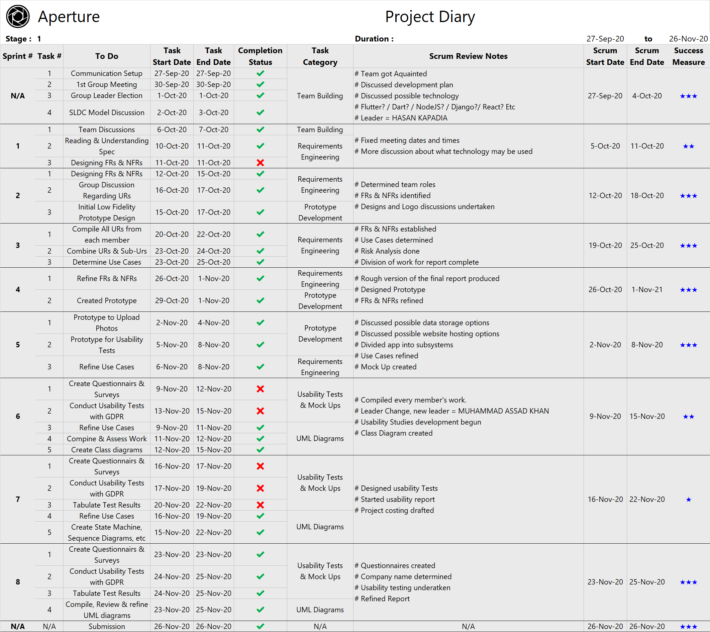
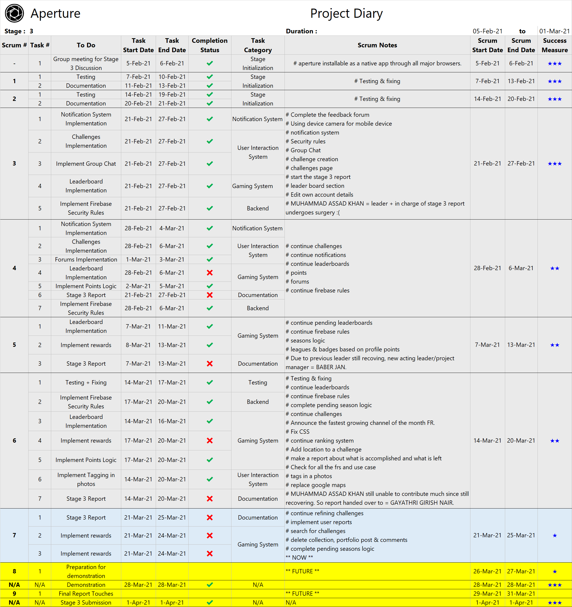
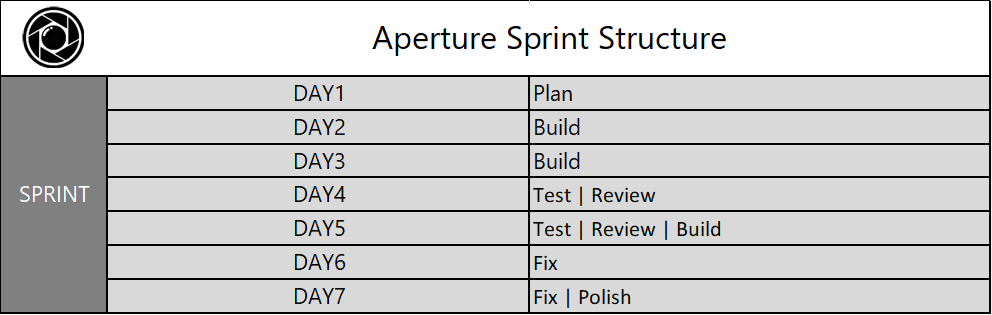

# Aperture By Octech Solutions

### Formal Team

**Line Manager**

​	Dr. Hani Ragab Hassen

**Team Lead**

​	Muhammad Assad Khan

**Acting Team Lead**

​	Baber Jan

**Members**

1. Baber Jan
2. Gaurav Gosain
3. Gayathri Girish Nair
4. Hasan Kapadia
5. Mohamed M Elfarash
6. Muhammad Assad Khan
7. Tasneem Hussein
8. Yoshi Jasmin

**Contents**

[TOC]

### The Vision

**Aperture** is a photo sharing application set in a fun, competitive and educational environment. 

By allowing users to create and enter photography challenges and gain points on their posts, aperture succeeds at giving users a unique gaming experience with players guaranteed a multitude of options to win challenges, badges and collect profile points.

Aperture allows users to share, comment and provide constructive feedback on posts in hopes of building an active, fun, encouraging and ever growing community of photography enthusiasts, hobbyists, professionals, gamers and anyone else who may be curious.

Every user's user experience, suggestions and privacy is important to us. Aperture enables users to report any content that they deem inappropriate or bugs that they discover to app managers. All application users shall follow a strict "no human in image" policy in adherence to our efforts at keeping this platform unbiased, focused on user contribution and free from legal hap hassle. 

****

### 1. Overview of the System (Gayathri)

*High-level overview of technologies and components.*

Aperture is a responsive, cross-browser compatible, web-based application developed primarily using ReactJS and supporting services.

##### 1.1. Technology Used 

- HTML, CSS, JavaScript
- React JS, JSX
  - React DOM
  - React Bootstrap
  - React-HTML5-Camera-Photo API
  - React-Redux
  - React Flip-Move
- Google Firestore (database, auth, storage) 
- Material UI
- Compress.js
- Node Package Manager (NPM)
- Visual Studio Code
- Github

*FIND OUT REMAINING TECH WE USED AND ADD HERE ...*

##### 1.2. High level Components

1. **User Account System**

   This component handles user signup/login, profile creation/deletion/management and validation of user details. This component ensures that users submit consent forms in order to upload a photo of themselves as their profile picture or alternatively choose from pre-defined avatar pictures instead. 

2. **Content Creation System**

   This component focusses on enabling users to create/destroy content on the application. Users may create posts (comprising of images - via image upload/taken using camera, associated GPS data and text), channels, collections, challenges and a portfolio. Users may delete any content that they have created. Features supported include modification of images during upload, tagging of objects/public events in images and sharing of content (on feedback/gaming forums, profile, collections, channels, challenges and portfolio).

3. **User Interaction System**

   This component enables interaction among users and/or application managers. Facilitated features include a chat between users, rating of posts, point (profile/challenge points) tracking, adding/deletion of comments, sending/accepting/ignoring friend requests, blocking/unblocking of users, following/unfollowing of channels, a feedback forum, a gaming forum, search/explore facility, news feed fetching, leaderboard management, participation in challenges, notification handling, user content/bug/help reporting management and making recommendations.

4. **Game Mechanics System**

   This component handles the game aspect of the application and deals with allowing users to create and participate in challenges and earn points and badges via user ratings on profile and challenge posts. Display of point status summary on leaderboards, announcing of winners and providing rewards are also managed by this system.

5. **Notification System**

   This system ensures that users are aware of all major events that they may be interested/involved in by sending notifications if and when they occur. Notifications will be sent when a user sends a friend request, likes a post, leaves a comment, accepts a friend request and deletes a challenge to name a few events.

6. **Application Improvement System**

   This component is the means through which users can contribute to improving the app by reporting bugs or inappropriate content. This system ensures that all user reports will be displayed to application managers so that they may monitor user satisfaction and take necessary action to ensure that the app remains safe and fun for all.

****

### 2. Detailed Design (Elfarash, Hasan, Assad, Gaurav(Class Diagram))

*Dataflow diagrams, UML diagrams, Class diagrams, etc.*

This section features visual aids that clarify/support design choices made. Significant diagrams that were described in detail in stages 1 and 2 of this project shall be revisited here in addition to new ones.

*MORE ...*

****

### 3. Final Interface Design

This section in addition to design elements and thoughts behind the final product, captures approaches that were taken and milestones reached along the way. Also included is a brief description of testing methods adopted to ensure technical correctness and a short guide to application installation, setup, maintenance and usage.

##### 3.1. Application Layout & Navigation (Elfarash, Yoshi)

*Layout and navigation of the application or applications.*

*MORE ...*

##### 3.2. Implementation Methodology (Gayathri)

*Iterations/Scrum/Other agile techniques?*

It was decided after considering both a fully pre-planned approach and an agile approach that agile process scrum would be the best choice of implementation strategy particularly because the wiggle room that agile provides is ideal for accommodating learning curves that would have to be overcome in order to produce a final product. 

Since all developers are students, it was expected that there would be a need to revisit and refine parts of the application from time to time. This approach of coming back to an implemented portion to further test and refine it in iterations was adopted to ensure that implemented parts of the application were indeed functional.

The primary implementation schedule involved weekly sprints where every team member would be allocated certain tasks to complete for the week. Given the COVID-19 scenario, all group meetings were online. Efforts were made to ensure that at least 1 meeting via Microsoft Teams occurred every week. All the while, the team remained constantly in touch with each other via a shared and project only WhatsApp group. Additionally, weekly meetings where the line manager was present took place every week.

It was decided that each member would regularly update all other members via a shared WhatsApp group exclusive to daily scrums, about their progress in what was termed a "Daily Scrum Report". This report would include what the member had been able to implement the previous day and what he/she was hoping on implementing on the current day. If a member was unable to complete his/her allocated task in the given time frame, then this task would be reallocated to the same/another member for the next sprint.  

This system although initially agreed upon was slowly established through the 3 stages. This system was fully in place and efficient starting mid stage 2.

##### 3.3. Development History (Gayathri)

*What was achieved in each iteration/sprint?*

The development history with major milestones and achievements taken from the "**Aperture Project Diary**" can be viewed below in 3 tables. One for stage1, stage2 and stage3 respectively. The "Success Measure" column ranging from 1 to 3 stars depict how successful/effective at getting work done, each sprint was.

<figure>
	
    <figcaption style="text-align:center;">Fig3. Project Diary - Stage 1</figcaption>
</figure>

<figure>
	
    <figcaption style="text-align:center;">Fig4. Project Diary - Stage 2</figcaption>
</figure>

<figure>
	
    <figcaption style="text-align:center;">Fig5. Project Diary - Stage 3</figcaption>
</figure>

*FIX TABLE TERMS! EDIT STAGE 3 (BLUE AND YELLOW PARTS) AS WE PROGRESS...*

*MORE ...*

##### 3.4. Testing Regimen (Yoshi)

*How was the final system tested for technical correctness?*

*MORE ...*

##### 3.5. Install - Setup - Maintain (Baber)

*Documentation on how to install/setup/maintain the final system.*

*MORE ...*

##### 3.6. User Guide (Baber)

*Short user guide.*

*MORE ...*

****

### 4. Project Evaluation

*Assess project as a whole.*  

This section, after an overall analysis of the the production process and final product, lays out organizational approaches taken, the development journey and value of the final product (includes descriptions of functionality achieved, limitations, unique elements and usability test results). 

##### 4.1. Organization (Gayathri)

###### 4.1.1. Organizational Structure

*How was your group organized?*

The group was organized such that every member would contribute to all parts of design and development. 

Some possible languages/technical skills which would potentially be needed in the project was identified and members were required to grade themselves and assign points reflecting their confidence levels in with regard to them. This was a good exercise in ascertaining capabilities of team members that would prove crucial in assigning team roles.

<figure>
	
    <figcaption style="text-align:center;">Fig1. Confidence Points</figcaption>
</figure>

In order to ensure optimum deployment of team members, a **SWOT analysis** was carried out.

<figure>
    

        
    

    <figcaption style="text-align:center;">Fig2. SWOT Analysis Square</figcaption>
</figure>

Based on observations and after discussion, following roles were initially decided upon. However, it was decided that all members would contribute to all areas of developments. The allocated roles would mean that every member would oversee/guide activities that would fall under his/her role description.

- Baber Jan - Back-End Lead Developer
- Gaurav Gosain - Front-End Lead Developer
- Gayathri Girish Nair - Programmer & Designer
- Hasan Kapadia - Team Leader & Database Lead Developer
- Mohamed M Elfarash - Programmer & Documentation In Charge
- Muhammad Assad Khan - Programmer & Report In Charge
- Tasneem Hussein - Graphic Design Lead & Programmer
- Yoshi Jasmin - Application Testing In Charge & Programmer

Towards the end of stage1, it was a collective decision to appoint Muhammad Assad Khan as the new leader as the previous leader was unable to fully commit to oversee the team due to personal issues. Later during stage 3, Baber Jan was selected as the project manager/acting team lead since Assad was unable to contribute on account of having to stick to a recovery regimen following medical eye procedures. As we worked together, each members' true strengths surfaced and it became clearer where each member would be most valuable given a task. 

Following is a categorization of members as per their primary aptitude adhering to **Honey’s 5 Team Member Types**. 

<figure>
	
    <figcaption style="text-align:center;">Fig3. Honey's 5 Team Member Types</figcaption>
</figure>

- **Leader**: Ensures clear objectives, collective involvement and commitment.
- **Challenger**: Questions effectiveness, presses for improvement and results.
- **Doer**: Is practical, reminds team to keep moving and thereby drives team forward.
- **Thinker**: Produces carefully considered ideas and critically reflects upon other ideas/achievements.
- **Supporter:** Maintains team harmony and helps carry out/complete tasks.

That said, it was observed that collective efforts undertaken by the team led to all members qualifying to befit many of the above categories at various stages of design, development and documentation.

*EDIT IF NEEDED ...*

###### 4.1.2. Success Story 

*Was the group organization successful? How well did your group collaborate?* 

*MORE ...*

###### 4.1.3. Overcoming Problems 

*How did you handle any problems which arose?*

*MORE ...*

###### 4.1.4. Sticking To Schedule 

*How successful were the timings in your original plan?*

*MORE ...*

##### 4.2. Implementation

###### 4.2.1. Implementation Schedule (Gayathri)

*What was your implementation schedule? How did the implementation schedule differ from the original plan?*

The implementation schedule took place in sprints where a single sprint would typically span a week. A stage of development was expected to be complete in 7-8 sprints which was indeed the case for all 3 stages of development.  Each sprint would have a plan drafted on day 1 with some goals to achieve in mind. Following days would be used to build, test, review and fix the portion of the application/document which was due that sprint. For sprints that were shorter than a week, some activities like building was done in parallel to testing and producing documentation.

 <figure>
	
    <figcaption style="text-align:center;">Fig4. Implementation Schedule</figcaption>
</figure>

The implementation schedule for development of Aperture drawing from the project diary (see section 3.3. Development History), has remained close to initial plans for stages 1 and 2 with a little deviation from the original plan. The implemented schedule for stage 3, however was quite different from the initial plan due to the need for an increased understanding of ReactJS contributing to some time lost in learning and failed attempts at achieving functionality particularly during the 1st 2 sprints of stage 3. Unforeseen health issues faced by team members particularly our leader proved to be a setback especially with regards to work on the stage 3 report and accompanying documentation. Hence, greater collaboration and effort was required toward the end of stage 3 which was key in overcoming ordeals and submitting a finished product and necessary documentation. 

###### 4.2.2. Path to Success (Gayathri)

###### *provide examples*

*Was your implementation approach successful (scrum, other, etc)? Why or why not? Use specific examples from your experiences to support your discussion.* 

<u>Pros</u>

- Initially the team was very lost and awestruck at the massive task that lay ahead. This is when the decision to sit down and **identify systems** that would make up our application proved helpful. Initially 11 systems where identified which was then narrowed down to 6 ...

  1. User Account System
  2. Content Creation System
  3. User Interaction System
  4. Game Mechanics System
  5. Notification System
  6. Application Improvement System

  This breakdown of the application allowed the team to develop a wholesome view of what the application would look like and what it would be capable of. We then went on to tackle one system at a time, always beginning by identifying main tasks and implementing them.

- The **flexibility** that **scrum** provides allowed us to implement parts of the app that felt manageable at a given moment knowing that once the team had amassed further knowledge regarding a topic, those very basic versions first implemented in a previous scrum may be revisited, tweaked and refined in a later scrum.

- Having a **scrum master** that regularly discussed with the group and allocated tasks on a weekly basis, at times, even daily basis allowed for the team to always have **an idea about the next most important task.** At instances where the team was faced with an especially challenging system like the user interaction system with multiple components like creation/deletion of posts, collections etc, the scrum master's breakdown of large tasks into small tasks allocated frequently led to the team being able to divide and conquer it.

- **Daily scrums** were a constant reminder of just how much had been and were yet to be achieved every week. Any sprint tasks not achieved this week would be reallocated next week in addition to other tasks. This succeeded at keeping the team on toes and though at variable rates, **weekly sprints ensured that weekly progress was made**.

- Every sprint would culminate in all members reviewing and testing out functions implemented thus far before suggesting fixes/improvements that would be implemented in the next sprint if deemed necessary. These **implement > test > fix > implement next** iterations ensured that the team **produced working parts** of the application almost **every week** and it would be **unlikely** that these parts **would need to be changed later** on. This approach also meant that we would have a new working feature to show our line manager at nearly every meeting. 

- Opting **React JS** enabled the team to create **components** that could be **reused** and take advantage of **vast libraries and frameworks** that React supports like Material UI, React Bootstrap etc. Due to React being a popular choice amongst application developers, **finding** online **tutorials** and **reading material** on it **was not difficult**. 

<u>Cons</u>

- Opting **ReactJS** meant that most of the team had to take the **time to learn** its key features. This resulted in some time in our development journey (Scrums 1 & 2 of stage 3) getting dedicated to learning it. Also, lack of sufficient knowledge of how to achieve a particular task had resulted in slower progress than ideal at several points in Stages 2 and 3 corresponding to implementing complex systems like the user interaction system, game mechanics system and chat feature.

- The constant pressure to produce **daily scrum reports** was **at times overwhelming**.

- The team was always very active and driven to produce a great product. Every member had **lots of ideas/opinions** to make the application better. Whilst this meant no shortage of options, it also meant that it took **longer to reach a consensus** and would also lead to **disagreements** that had to be resolved from time to time. This scenario was especially prevalent during the **initial stages** of development when the team was just coming together. **By Stage 3**, however, the team was **united** and had understood strengths and the value of each member. 

  **For example...**

  - A debate as to whether to implement adding posts to challenges by allowing addition of previous posts to a challenge via tags as opposed to allowing new posts dedicated to a challenge to be created by a user that arose in stage 3, culminated in a well thought out blend of both ideas where old posts could be added to challenges via a copy of that post participating in the challenge whilst at the same time enabling users to create new posts exclusive to a challenge. 
  - A more trivial debate that occurred initially during stage 1 regarding how to represent requirements in the report (table/bullet points) lead to the team spending time discussing about a small detail. Few more similar less significant idea clashes occurred during stage 1.
  - This scenario shows how a debate that occurred in stage 3 led to constructive improvement of functionality compared to petty disagreements from stage 1 showing the evolution of the team from a ragtag ensemble of passionate students to a real team that's goal oriented and focused on the betterment of the product.

- Parts of the specification given were ambiguous and sometimes vague like when it was mentioned in that the system would enable users to provide feedback and leave comments, it is confusing because comments are feedback and no further explanation of what feedback ideally looks like here was mentioned. The team understood that such inexplicit areas of the report to be intentional opportunities to allow development teams to come up with unique spins on the application and chose to do just this.

Overall, it is safe to say that our approach was successful in helping keep the team close knit and productive. When problems arose, the team was able to rise to the challenge and brave though it. The milestones we set for ourselves and achieved via sprints, gave us a sense of accomplishment and was a source of motivation in our development journey.

*NEED SPECIFIC EXAMPES & MORE POINTS ARE WELCOME ...*

###### 4.2.3. Tools Used (Hasan)

*Which languages, tools, and techniques did you use? How suitable were they?*

*MORE ...*

##### 4.3. Product (Tasneem)

###### 4.3.1. Functionality Achieved

*Report achieved functionality. Provide outline summary on functions and then give details. How many of your requirements did you meet? (Example = A table showing to what extent each of the numbered functional requirements have been completed.)* 

*MORE ...*

###### 4.3.2. What's Special?

*What is particularly special about your product?  Have you included extra features? How robust is your final system?*

*MORE ...*

###### 4.3.3. Bugs/Constraints

*Are there known bugs or constraints?*

*MORE ...*

###### 4.3.4. Usability Results

*How usable did your subjects find the final system? Include a brief summary of results.* 

*MORE ...*

****

### Appendix (Yoshi)

 *Appendix of Supporting Documentation. Any other supporting documentation that might be relevant (Examples = project diaries/report, original implementation plan, marketing material, etc).*

*MORE ...*