# Aperture By Octech Solutions

 

### Formal Team

**Line Manager**

​	Dr. Hani Ragab Hassen

**Team Lead**

​	Muhammad Assad Khan

**Acting Team Lead**

​	Baber Jan

**Members**

1. Baber Jan
2. Gaurav Gosain
3. Gayathri Girish Nair
4. Hasan Kapadia
5. Mohamed M Elfarash
6. Muhammad Assad Khan
7. Tasneem Hussein
8. Yoshi Jasmin

### Executive Summary

This document is an overview of the journey of the photo sharing application Aperture by Octech Solutions from design through development culminating in the beautiful product it is today.

How better to start the story of development of Aperture than with an opportunity to try it out?!  Try out Aperture at https://aperture-by-octech.herokuapp.com/.

Visit our company website to find more information about Octech solutions and the amazing team behind it at https://octech.herokuapp.com/.

**Aperture can be viewed as comprising of 6 sub-systems.**

1. User Account System
2. Content Creation System
3. User Interaction System
4. Game Mechanics System
5. Notification System
6. Application Improvement System

To begin, an overview of the system, technology used and its components shall be provided moving on to various visual representations using Use Case and Sequence diagrams depicting the working of parts of the system can be found. 

Then the layout of the app and steps via which to navigate through it are laid down followed by a description of implementation methodology and testing methods adopted by the development team is made available along with a log of achievements realized at various points of time in development. 

A guide to installing, setting up and maintaining Aperture is provided in addition to a user guide.

Finally, this document features a project evaluation section that covers topics like team organization, implementation schedule / process and the features of the final product with all achievements and failure to achieve mentioned in detail. This section boasts artifacts like the aperture project diary, implementation charts, tables depicting project requirements completion status etc.

The Appendix of this documentation contains supporting documents like a Usability Evaluation document, a list of all Functional and Non-Functional Requirements, etc.

**Contents**

[TOC]

### Introduction

##### Purpose

This report outlines the developmental progress of the Aperture application. The report will consist of an overall low level and high-level overview of the system and its components, diagrams to visualize the workings of the architecture and details, system testing for technical correctness according to our client’s expectations and a section with project evaluation observations. This will ensure the client Dr. Richard Freedman and his associates fully understand and comprehend the Aperture system functionalities..

This document is intended to be read by but not limited to

1. The client Dr. Richard Freedman and his associates so they are completely aware of the current state of the Aperture application.
2. The OcTech Solutions development team as a reference. This document will also assist the development team in maintaining the application post deployment.

##### Scope

There is one system called “Aperture”. The document contains the high-level overview of technologies and components for the 6 sub-systems of Aperture,

1. Content Creation System
2. User Account System
3. User Interaction System
4. Game Mechanics System
5. Notification System
6. Application Improvement System

These sub-systems will be developed and operational under the guidelines of GDPR and W3C regulations to maintain a high standard. Comprehensive and in-depth details of each sub-system is provided in the Stage 1 document submitted on the 26th of November 2020.

This document submitted on 1st April 2021 contains the final design of the Aperture system. It provides a comprehensive summary of the development  journey and project management decisions.

##### Overview

This document provides an in-depth and cohesive breakdown of all the design and project/team management decisions which were made while developing the system. It will provide an overall overview of the final product along with the environment used to develop and deploy it and a high-level overview of the architecture of the system / sub-systems. Explanation of the user interface will also be provided, in addition to a user guide video and installation - setup - management guides. The testing methodologies used to test robustness and technical correctness as per our and our client’s expectations will be followed by an in depth discussion of the implementation schedule, problem solving decisions taken etc related to the development journey. Usability tests carried out and their results shall also be briefly stated with a detailed Usability Evaluation Section available in the Appendix.

****

### The Vision

**Aperture** is a photo sharing application set in a fun, competitive and educational environment. 

By allowing users to create and enter photography challenges and gain points on their posts, aperture succeeds at giving users a unique gaming experience with players guaranteed a multitude of options to win challenges, badges and collect profile points.

Aperture allows users to share, comment and provide constructive feedback on posts in hopes of building an active, fun, encouraging and ever growing community of photography enthusiasts, hobbyists, professionals, gamers and anyone else who may be curious.

Every user's user experience, suggestions and privacy is important to us. Aperture enables users to report any content that they deem inappropriate or bugs that they discover to app managers. All application users shall follow a strict "no human in image" policy in adherence to our efforts at keeping this platform unbiased, focused on user contribution and free from legal hap hassle. 

****

### 1. Overview of the System

*High-level overview of technologies and components.*

This section provides a complete detail of the Aperture system’s design and implemented functionalities. The product scope will be provided along with supporting diagrams to help visualize the intricacies of the applications and help ease the understanding of the technical complexities of the system. The technologies and components used in the applications development and hosting will also be outlined.

##### 1.1. Product Scope

The scope of the product known as Aperture is a photo-based social media application with in integrated “playification” system as requested by our client Dr. Richard Freedman.
The application has been designed to have a trendy and sleek looking user interface which is highly responsive such that the user experience is intuitive for all age groups and demographics. A strict socially responsible policy and a non-tolerance policy towards any shared content featuring humans or partially visible humans or human body parts helps ensure that Aperture remains a safe and secure place where people from all backgrounds are able to interact. Users will be able to create Channels, Portfolios and Collections to showcase their photography. The best photographs will earn the creator of the post points as other users rate them high. The live firestore database will contain all the necessary information and posts from each user to seamlessly render each section of the application without any delay to ensure good user experience.

##### 1.2. Environment

The web application will be hosted using a cloud platform application called Heroku which is a platform using a service (PaaS) which will be used to deploy and scale our Aperture system in its infancy. The web-application will be supported on mainstream browsers such as Google Chrome, Mozilla Firefox, Apple Safari, Microsoft Edge, and DuckDuckGo. 

##### 1.3. Technology Used

- HTML, CSS, JavaScript
- React JS, JSX
  - React DOM
  - React Bootstrap
  - React-HTML5-Camera-Photo API
  - React-Redux
  - Material-ui/core
    - Material-ui/icons 
    - Material-ui/lab 
  - Tenserflow-lite
      - tensorflow-models/coco-ssd
      - tensorflow/tfjs-backend-cpu
      - tensorflow/tfjs-backend-webgl
      - tensorflow/tfjs-converter
      - tensorflow/tfjs-core
  - Autosuggest-highlight
  - Avataaars
  - compress.js
  - filerobot-image-editor
  - framer-motion
  - moment
  - react-bootstrap
  - react-copy-to-clipboard
  - react-countdown
  - react-countup
  - react-cropper
  - react-datepicker
  - react-flip-move
  - react-giphy-searchbox
  - react-google-places-autocomplete
  - react-leaflet
  - react-map-gl
  - react-medium-image-zoom
  - react-router-dom
  - react-scripts
  - swiper
  - web-vitals
- Google Firestore
- Firebase Authentication
- Firebase Storage
- Node Package Manager (NPM)
- Visual Studio Code
- Github
- Heroku CLI
- Ionic/Capacitor
- Visual Studio Code
- Github

##### 1.4.  Broad Sub-Systems

1. **User Account System**

   This component handles user signup/login, profile creation/deletion/management and validation of user details. This component ensures that users submit consent forms in order to upload a photo of themselves as their profile picture or alternatively choose from pre-defined avatar pictures instead. 

2. **Content Creation System**

   This component focusses on enabling users to create/destroy content on the application. Users may create posts (comprising of images - via image upload/taken using camera, associated GPS data and text), channels, collections, challenges and a portfolio. Users may delete any content that they have created. Features supported include modification of images during upload, tagging of objects/public events in images and sharing of content (on feedback/gaming forums, profile, collections, channels, challenges and portfolio).

3. **User Interaction System**

   This component enables interaction among users and/or application managers. Facilitated features include a chat between users, rating of posts, point (profile/challenge points) tracking, adding/deletion of comments, sending/accepting/ignoring friend requests, blocking/unblocking of users, following/unfollowing of channels, a feedback forum, a gaming forum, search/explore facility, news feed fetching, leaderboard management, participation in challenges, notification handling, user content/bug/help reporting management and making recommendations.

4. **Game Mechanics System**

   This component handles the game aspect of the application and deals with allowing users to create and participate in challenges and earn points and badges via user ratings on profile and challenge posts. Display of point status summary on leaderboards, announcing of winners and providing rewards are also managed by this system.

5. **Notification System**

   This system ensures that users are aware of all major events that they may be interested/involved in by sending notifications if and when they occur. Notifications will be sent when a user sends a friend request, likes a post, leaves a comment, accepts a friend request and deletes a challenge to name a few events.

6. **Application Improvement System**

   This component is the means through which users can contribute to improving the app by reporting bugs or inappropriate content. This system ensures that all user reports will be displayed to application managers so that they may monitor user satisfaction and take necessary action to ensure that the app remains safe and fun for all.

   

##### 1.5. System Architecture - MVC

Aperture was developed using ReactJS in conjuncture with Google Firestore's firebase. It was decided to  view the system from a **Model View Controller (MVC)** perspective.

**MVC was chosen due to the following reasons.** (John Prabhu, 2019)

- Since it divides the application into 3 parts, different members would be able to work on code related to different parts simultaneously thus making the overall development process faster.
- Our application would have many asynchronous calls related to getting, setting and updating collections in the Firestore DB. MVC supports asynchronous techniques.
- It demarcates Model View and Controller parts of the system well such that modifying one part would not necessarily change other parts. This is convenient as our development plan using scrum would mean that systems would frequently be changed and improved in later iterations.

<figure>
    

        
    

    <figcaption style="text-align:center;">
        MVC Perspective
    </figcaption>
</figure>

The above diagram represents our application using MVC concepts. Here, the **model** is represented by firebase, the data being stored and the data being transferred between the model and the controller. The **view** is represented by the components with which the user interacts in the UI. Here, redux together with react-dom acts like the **controller**. Any changes/events triggered using the components/child components trigger a state change which is handled by the controller.

React interacts with firebase servers with request calls and receives firebase responses in the form of JSON objects which are used to fetch stored data from firestore storage. The components render the photos, comments, profile information in the application. If there is a state change in the component due to a UI triggered event, then a dispatch call would be made to the Controller which results in an action and a new state which updates the current state.

<figure>
    

        
    

    <figcaption style="text-align:center;">
        React Redux Working
    </figcaption>
</figure>

Above figure represents the workings of React Redux which is a state management tool and acts as a wrapper around the React JS library.

<figure>
    

        
    

    <figcaption style="text-align:center;">
        Redux - React Components - FirebaseDB Interaction
    </figcaption>
</figure>

Above figure shows how Redux interacts with react components and the Firestore database. React redux wraps around the parent and child components of react and allows state changes among child components and send queries and receive responses from firebase through React Redux.

<figure>
    

        
    

    <figcaption style="text-align:center;">
        User Application Firebase Interaction
    </figcaption>
</figure>

Above figure represents the interaction of the user with the app and the app working in tandem with Firebase. The user accesses the app through their browser and has multiple sections where they can interact such as their Profile, Explore Page, Image Feed and the Chats, these sections read and write data to the database such as the user posting an image or viewing their friends post to rate and comment on them. The user’s profile can be split into Collections, Channels, Portfolios and Posts where the user can upload photos from their device storage or take a photo using their device’s camera. These photos are saved as base 64 strings after being edited and posted.

##### 1.6. Database Design and Usage

Aperture has been constructed using firebase as our main DB. Firebase provides us with many key features for developing web or mobile apps. 

**Some of the functionalities provided by firebase are as follows.**

- **Storage:** Firebase storage feature is powered by Google Cloud Storage and allows users to easily download media files and visual contents. This feature is also helpful in making use of user-generated content.
- **Crash Analytics:** Firebase is capable of monitoring and keeping a watch out for any fatal errors, performance errors, crash reports, etc.
- **Authentication:** Firebase backend service offers a powerful authentication feature. It comes equipped with simple SDKs and easy to use libraries to integrate authentication feature with any mobile app (Contributor, 2018) 

In our app we have used all these features to provide users with the most seamless and best experience in using Aperture. 

###### 1.6.1 Database Design

As stated, above firebase is used as our backend database tool as it provides us with many features, easy to integrate systems and the tools it provides us developers with. We decided to use firebase because generally all these features would have to be built from scratch and implemented but with them being given to us by firebase it enables to focus more on the app experience. (Stevenson, 2018)

<figure>
    

        
    

    <figcaption style="text-align:center;">
        Firebase Backend Services
    </figcaption>
</figure>

As shown above, traditionally we would be writing both frontend and backend code. The frontend code just invokes API endpoints exposed by the backend, and the backend code does the work. However, with Firebase products, the traditional backend is bypassed, and all of this is kept secure by enforcing administrative access which is provided by firebase console.

Overall firebase provides us with great functional tools making the entire backend process easier to implement and allowing us to further improve on the usability, functionalities, and features of the app.

###### 1.6.2. Firebase Authentication System

As explained above firebase is a very feature rich database tool, but it also has its own upsides and downsides to it. Firebase provides an authentication feature making it easier for us to know the identity of a user and allow them to access the app securely with the user data being stored securely over the cloud. 

The Authentication system which boasts a highly secure system that improves the user experience while they sign-up and sign-in:

- It allows sign-in using email & password, phone authentication, Google, Facebook, Twitter, GitHub, and much more.
- It is also easy to implement with no more than 10 lines of code to build it.
- and Firebase Authentication is super secure as it has been developed by none other than Google’s sign-in team.

<figure>
    

        
    

    <figcaption style="text-align:center;">
        Firebase Authentication System
    </figcaption>
</figure>
The above diagram gives an in-depth look on how firebase handles authentication.

###### 1.6.3 Firebase Security Rules

The one major flaw of firebase was the security which also went against the GDPR Data privacy regulations. This was countered by adding Security rules that only allow authenticated users to use our app, 

The rules work by checking across our FirestoreDB to ensure that the user signing into our app are authenticated by our system, and by checking for any user who is trying to breach our app whom if found shall be blocked from accessing our DB.

The Firestore rules work by cross referencing each user’s unique authentication id with their name and our database to check that each user trying to access the specific collection is an actual user of our app.

Firebase security rules help in enforcing security and validating all requests made to the app. These rules work in conjunction with the real-time database by checking and ensuring that every request being is by an authenticated user who is not violating the constraints/limitations placed. If any requests were found to violate the security rules, they are either blocked or deleted. 

###### 1.6.4 Firestore Database Structure

The Firestore database consists of collections which have documents and can have further sub-collections within to data. The following are collection tree diagrams to show each collection and its contents.

<figure>
    

        
    

    <figcaption style="text-align:center;">
        Firestore DB Collection - users
    </figcaption>
</figure>

The above tree diagram depicts the **users** collection which also has another sub-collection within, which contains the notifications of the user.

<figure>
    

        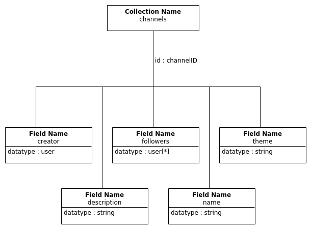
    

    <figcaption style="text-align:center;">
        Channels Collection
    </figcaption>
</figure>

The above tree diagram shows the fields of the **channels** collection stored in firebase with fields corresponding to attributes of a channel.

<figure>
    

        
    

    <figcaption style="text-align:center;">
        Firestore DB Collection - chatRooms
    </figcaption>
</figure>

The above tree diagram depicts the **chatRooms** collection stored in firebase which also has another sub-collection within, which contains the messages of the user.

<figure>
    

        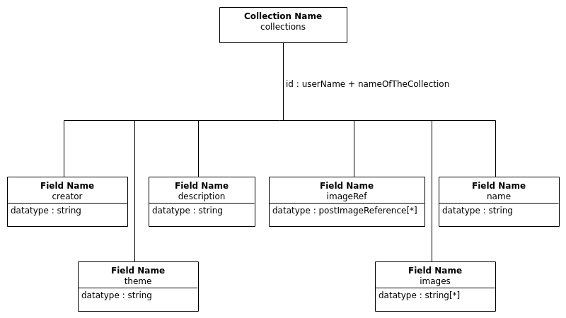
    

    <figcaption style="text-align:center;">
        Firestore DB Collection - collections
    </figcaption>
</figure>

The above tree diagram represents the **collections** collection with fields storing attributes of a collection.

<figure>
    

        
    

    <figcaption style="text-align:center;">
        Firestore DB Collection - portfolios
    </figcaption>
</figure>

The above tree diagram represents the **portfolios** collection stored in firebase which contain a user's portfolio details.

<figure>
    

        
    

    <figcaption style="text-align:center;">
        Firestore DB Collection - seasons
    </figcaption>
</figure>

The above tree diagram shows the **seasons** collection stored in firebase where all data regarding a season is stored.

<figure>
    

        
    

    <figcaption style="text-align:center;">
        Firestore DB Collection - challenges
    </figcaption>
</figure>

The above tree diagram shows the **challenges** collection stored in firebase.

<figure>
    

        
    

    <figcaption style="text-align:center;">
        Firestore DB Collection - challengePosts
    </figcaption>
</figure>

The above tree diagram shows the **challengePosts** collection stored in firebase where attributes of a challenge post are stored.

<figure>
    

        
    

    <figcaption style="text-align:center;">
        Firestore DB Collection - forumPosts
    </figcaption>
</figure>

The above tree diagram shows the **forumPosts** collection stored in firebase where all attributes of a forum post are stored.

<figure>
    

        
    

    <figcaption style="text-align:center;">
        Firestore DB Collection - globalLeaderBoards 
    </figcaption>
</figure>

The above tree diagram shows the **globalLeaderBoards** collection stored in firebase.

<figure>
    

        
    

    <figcaption style="text-align:center;">
        Firestore DB Collection - postImages
    </figcaption>
</figure>

The above tree diagram shows the **postImages** collection stored in firebase where all attributes of an image within a post are stored.

<figure>
    

        
    

    <figcaption style="text-align:center;">
        Firestore DB Collection - postReports
    </figcaption>
</figure>

The above tree diagram shows the **postReports** collection stored in firebase where all data regarding reported posts are stored.

<figure>
    

        
    

    <figcaption style="text-align:center;">
        Firestore DB Collection - bugReports
    </figcaption>
</figure>

The above tree diagram shows the **bugReports** collection stored in firebase where all data regarding a reported bugs are stored.

<figure>
    

        
    

    <figcaption style="text-align:center;">
        Firestore DB Collection - posts
    </figcaption>
</figure>

The above tree diagram shows the **posts** collection stored in firebase where all attributes of a post are stored.

In total 13 collections are currently in our Firestore database which makes it possible to achieve all functionalities of the application possible and provides a quick, smooth response during queries to/responses from from the database.

****

### 2. Detailed Design

*Dataflow diagrams, UML diagrams, Class diagrams, etc.*

This section features visual aids that clarify/support design choices made. Significant diagrams that were described in detail in stages 1 and 2 of this project shall be revisited here in addition to new ones.

**After Stage 3, all 6 sub-systems are completed.** The 1st 3 sub-systems with use case diagrams depicting them along with supporting sequence diagrams have been provided and explained in details in stage 2 report. Use case diagrams related to systems 4, 5 and 6 have also been presented in the stage 1 report. These diagrams shall be revisited here. New sequence diagrams in support of systems 4, 5 and 6 will can be found below.

#### Use Case and Sequence Diagrams

##### 1. User Account System

<figure>
    

        
    

    <figcaption style="text-align:center;">
        Use Case Diagram - User Account System
    </figcaption>
</figure>
Above use case diagram shows all the functionalities of the user account system along with the actors who will be interacting with the system and which actors will work in conjunction, so that an action is completely carried out. The 3 actors which will be interacting are:

1. User
2. User Content Database
3. Content Creation System

<figure>
    

        
    

    <figcaption style="text-align:center;">
        Sequence Diagram - Sign Up
    </figcaption>
</figure>

Above sequence diagram shows the 2 alternate ways on how a user can create an account on Aperture, they can either enter their details, or sign up with a google account. Then our Firestore database will create a new entry for the new user.

<figure>
    

        
    

    <figcaption style="text-align:center;">
        Sequence Diagram - Login
    </figcaption>
</figure>
Above sequence diagram represents how a user can login to their account provided they have one which exists in our Firestore database. Users can enter their email address and password which is verified by the database, can login and are taken to the Image Feed of the application. If a user decides to login with their Google Account, they click on the “Login with Google” button and then choose their google account or enter details for their google account. Firestore database verifies if a user exists with the given google account details, if not then there is a login error, and the user is told to try again, otherwise the login is successful and the user is taken to the Image Feed.

<figure>
    

        
    

    <figcaption style="text-align:center;">
        Sequence Diagram - Logout
    </figcaption>
</figure>
Above sequence diagram showcases the processes when a user decides to log out of their account. The user clicks on the “Log out” button which then sends a request to the system to clear the user’s current session. The user is then redirected to the login page after the system refreshes the window the user is currently in.

<figure>
    

        
    

    <figcaption style="text-align:center;">
        Sequence Diagram - Reset Password
    </figcaption>
</figure>
Above is a sequence diagram for Reset Password, the user clicks on the “Forgot Password” button on the login page, user is then prompted to enter their email address. The database will check if the entered email address has an account, if not then the user has to enter the correct email. If the entered email address has an account, then the system sends the user an email with a link. The user will visit that link which will prompt them to enter their new password. The database will then update the password for that email address for the user and the system informs the user that their password has been reset.

##### 2. Content Creation System

<figure>
    

        
    

    <figcaption style="text-align:center;">
        Use Case Diagram - Content Creation System
    </figcaption>
</figure>
Above is the use case diagram for the Content Creation System along with all the actors working in conjunction to carry out the specific functions so users can create and post content on the Aperture application. The actors involved in this system are:

1. User
2. Device Camera
3. Device Storage
4. Challenge Database
5. Channel Content Database
6. User Content Database

<figure>
    

        
    

    <figcaption style="text-align:center;">
        Sequence Diagram - Share Content
    </figcaption>
</figure>

Above sequence diagram shows the process which takes place when a user shares a post. A user can either choose a photo from their devices storage or take a photograph using their device camera. The system then gives the user options to apply filters, GIFS and Stamp Overlays to each photo, then a user enters a caption and uploads the photo, the images are saved as a base 64 string in the database under the user’s ID and the system renders that post in the Image Feed for the user and other users which follow him/her. The user can share and upload their content either on their profile, their channels, collections, or portfolios.

<figure>
    

        
    

    <figcaption style="text-align:center;">
        Sequence Diagram - Delete Post
    </figcaption>
</figure>

Above sequence diagram shows how a post is deleted, the post entry is removed from the database and as a result that post is removed from the user’s profile, the image feed of the user’s friends, the explore page and the channels if that post is also in a channel. Then the post would no longer be visible in the app as all details have been removed from the database.

<figure>
    

        
    

    <figcaption style="text-align:center;">
        Sequence Diagram - Create Channel
    </figcaption>
</figure>

Above is the sequence diagram showing creation of a channel. The user will click on a button which leads them to a form so the users can give the channel a name, a theme and a description for other users. The database will create a new entry for the user being the channel creator for the specific channel.

<figure>
    

        
    

    <figcaption style="text-align:center;">
        Sequence Diagram - Delete Channel
    </figcaption>
</figure>

Above is the sequence diagram for deleting a channel. The user would click on the “Delete Channel” button on a channel, the database would then remove the details and all posts in the selected channel. The system’s frontend would no longer show that channel in the User’s profile.

<figure>
    

        
    

    <figcaption style="text-align:center;">
        Sequence Diagram - CreateCollection
    </figcaption>
</figure>
Above sequence diagram shows the internal processes of creating a collection. The user will click on the “Create Collection” button, it will display the user a form where they can enter in their collection’s theme and a short description. These details will then be stored in the database under the user’s entry. The system will then display the collection to the user and let the user add photos to their collections.

<figure>
    

        
    

    <figcaption style="text-align:center;">
        Sequence Diagram - Delete Collection
    </figcaption>
</figure>

Above is the sequence diagram for deleting a collection. The user would click on the “Delete Collection” button on a collection, the database would then remove the details and all the photographs in the selected collection. The system’s frontend would no longer show that collection in the User’s profile.

<figure>
    

        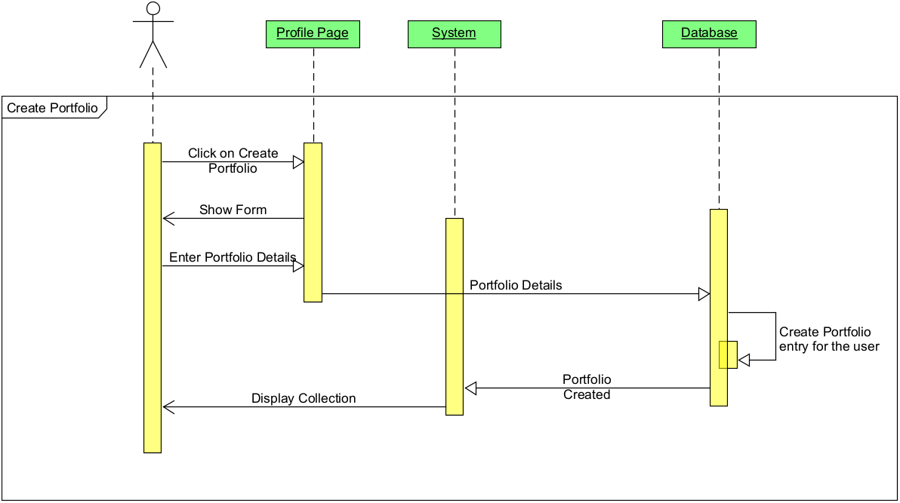
    

    <figcaption style="text-align:center;">
        Sequence Diagram - Create Portfolio
    </figcaption>
</figure>
Above is the sequence diagram which shows the processes on creating a portfolio. Only one portfolio can be created per user and the user can fill in details such as the user’s first name and last name, a description of the portfolio, a quote, and a display picture. The database would create an entry for the user’s portfolio and store the details along with the photos uploaded to the portfolio. The collection once created is then displayed in the user’s profile page.

<figure>
    

        
    

    <figcaption style="text-align:center;">
        Sequence Diagram - Delete Portfolio
    </figcaption>
</figure>
Above represents the sequence diagram for deleting a portfolio. The user would click on the “Delete Portfolio” button on the portfolio, the database would then remove the details and all the photographs from the portfolio. The system’s frontend would no longer show the portfolio in the User’s profile.

<figure>
    

        
    

    <figcaption style="text-align:center;">
        Sequence Diagram - Toggle Public/Private Post
    </figcaption>
</figure>
Above is the sequence diagram which represents how is a post kept public or private. A user can choose to keep a post public or private while creating the post and after the photos have posted then the user can toggle the option to keep the post public or private. If the post is public then all users can view the post by going to the user’s profile but if a post is private, then only users added as friend of the user are able to view the private posts.

<figure>
    

        
    

    <figcaption style="text-align:center;">
        Sequence Diagram - Add a Post to Portfolios/Collections
    </figcaption>
</figure>
Above is the sequence diagram which shows the process in adding an existing post to a user’s portfolio or a collection. Every post has a menu button and when you click it, the option to add the images of the post to the portfolio and collection are given if you have a collection. If a person does not have a collection, then the option for the collection does not show. If a person does not have a portfolio but clicks on the button, then an error message will pop up telling the user to create a portfolio first. If a user has multiple collections, then the user is given the option to choose which collection to add the post images to. Once chosen, the images can be viewed in the portfolio or in that collection.

##### 3. User Interaction System

<figure>
    

        
    

    <figcaption style="text-align:center;">
        Use Case Diagram - User Interaction System
    </figcaption>
</figure>
Above is the use case diagram representing the User Interaction System of Aperture. This system is composed of all the functionalities which allow users to interact with each other within Aperture. The actors in this system are:
1. User
2. Content Creation System
3. Notification System (Stage 3)
4. User Content Database
5. Game Mechanics System (Stage 3)
6. Challenge Content Database
7. Channel Content Database
8. Device GPS

<figure>
    

        
    

    <figcaption style="text-align:center;">
        Sequence Diagram - Send Friend Request
    </figcaption>
</figure>
Above is the sequence diagram for the functionality of a user sending a friend request and being able to cancel a friend request. If a user wants to send a friend request, then they must search for a user and visit their profile page. Then they can click a button to send a friend request. The database will update for both users the friend requests, the sender, and the receiver of the request. If the user wants to cancel a friend request, then they must visit a user’s profile whom they have already sent a friend request to. The user can then click on the option to cancel friend request, the database will then clear the friend requests for both users. The user can send the same user another friend request if the user wants to add the other user as a friend.

<figure>
    

        
    

    <figcaption style="text-align:center;">
        Sequence Diagram - Accept Friend Request
    </figcaption>
</figure>
Above is the sequence diagram for accepting a friend request. In stage 3 the user will be notified when a user receives a friend request. The user will visit the profile page of the user who sent the friend request. The user will then click on the button to accept the friend request, in the background the database will update both the user’s friend lists by adding in the new user as a friend. Both users will now be able to view private posts from each other in their Image Feed and chat with each other.

<figure>
    

        
    

    <figcaption style="text-align:center;">
        Sequence Diagram - Add Comment
    </figcaption>
</figure>
Above is the sequence diagram for posting comments on a post, the user can click on the comment’s icon on a post and then type in the comment box and click submit. The database will update the comment’s field of the post and other users will be able to see the comments from other users along with their usernames.

<figure>
    

        
    

    <figcaption style="text-align:center;">
        Sequence Diagram - Block User
    </figcaption>
</figure>
Above is the sequence diagram for how to block and unblock a user. A user will visit another user’s profile page and will click on the “Block user” button. The database will then add the blocked user to the blocked users list. Both users will now not be able to view each other’s profile. To unblock a user, the user must search for that user and click on unblock. The database will remove the unblocked user from the blocked list and now both users can view each other’s profile and send friend requests.

<figure>
    

        
    

    <figcaption style="text-align:center;">
        Sequence Diagram - Chat
    </figcaption>
</figure>
Above is the sequence diagram for the chat system, the user navigates to the chat section by clicking on the icon on the footer of the page. The chat interface is displayed to the user and they can search for a user who is added as their friend. A new chat room is created in the database and the user can send a message to their friend. Both users can chat with each other now.

<figure>
    

        
    

    <figcaption style="text-align:center;">
        Sequence Diagram - Follow Channel
    </figcaption>
</figure>
Above is the sequence diagram for following and unfollowing channels, to follow a channel the user can visit the channels tab in the Explore page and then click on any channel they want. The user can select a channel and clicks on follow channel, the database will then update the following list for the user after which the user can view all posts of the channel in the Image Feed. To unfollow a channel the user can go their profile and click on Following Channels, the database will retrieve of all channels being followed by the user. The user can then visit that channel and click the unfollow button. The database will then remove that channel from the user’s following list and the app would no longer show those posts in the user’s Image Feed.

<figure>
    

        
    

    <figcaption style="text-align:center;">
        Sequence Diagram - Rate Post
    </figcaption>
</figure>
Above sequence diagram outlines how a post is rated. The user can rate a post to a maximum of 3 stars, once a user rates the post, that rating value is stored into the database for that post from a specific user so on the user’s feed, he/she can see what rating was given. In the background, the database adds this new rating for the post and also updates the profile points of the user which is linked with the Game Mechanics System to be completed in stage 3.

<figure>
    

        
    

    <figcaption style="text-align:center;">
        Sequence Diagram - Share Content
    </figcaption>
</figure>
Above is the sequence diagram for a user searching for other users or channels, the user navigates to the explore page, discussed later with additional functionalities, the user then types the username of the user or the channel name, the database would then retrieve all the search results and display them as a list to the user.

<figure>
    

        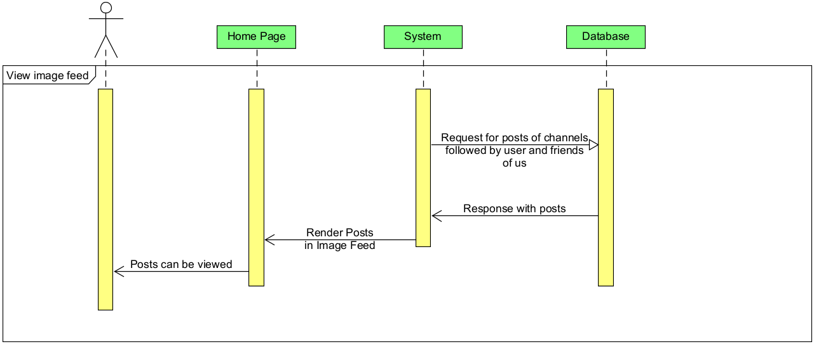
    

    <figcaption style="text-align:center;">
        Sequence Diagram - Image Feed
    </figcaption>
</figure>
Above is the sequence diagram for viewing the Image Feed of a user. The system makes a request to the database to return all public and private posts of user’s friends along with all posts of all channels the user follows. The system then renders these images in the Image Feed where the user can view all posts and interact with them such as commenting or rating them.

<figure>
    

        
    

    <figcaption style="text-align:center;">
        Sequence Diagram - View Photo Map
    </figcaption>
</figure>
Above is the sequence diagram for viewing the “Map View” of a post/photo. The user will click on the map icon of a post which will send a database query which will retrieve the geo location of where the post was taken. That location is shown in a map view using Google Maps API.

<figure>
    

        
    

    <figcaption style="text-align:center;">
        Sequence Diagram - View Explore Page
    </figcaption>
</figure>
Above is the sequence diagram for the Explore page which consist of 2 tabs and the search functionality already discussed. The Explore page retrieves a list of channels and public posts from users who are not blocked or have not blocked the user in question. If the user clicks on the Posts tab then all public posts would be visible, if the user clicks on the Channel tab then all the channels would be visible. The user can then click on the usernames to visit the user’s profiles or click on the Channel names to visit the channel.

<figure>
    

        
    

    <figcaption style="text-align:center;">
        Sequence Diagram - Search
    </figcaption>
</figure>

Above is the sequence diagram for a user searching for other users or channels, the user navigates to the explore page, discussed later with additional functionalities, the user then types the username of the user or the channel name, the database would then retrieve all the search results and display them as a list to the user.

##### 4. Game Mechanics System

<figure>
    

        
    

    <figcaption style="text-align:center;">
        Use Case Diagram - Game Mechanics System
    </figcaption>
</figure>

##### 5. Notification System

<figure>
    

        
    

    <figcaption style="text-align:center;">
        Use Case Diagram - Notification System
    </figcaption>
</figure>

<figure>
    

        
    

    <figcaption style="text-align:center;">
        Sequence Diagram - View Notification
    </figcaption>
</figure>

<figure>
    

        
    

    <figcaption style="text-align:center;">
        Sequence Diagram - Recieve Notification
    </figcaption>
</figure>

The above sequence diagrams show how the user can view notifications and how the user receives notification. The user will click on the bell icon to view any notifications that the user receives. The user will receive friend request notifications, chat notifications, post rating notifications, league placement notification and more. The system displays the notifications to the user on the notification page. A notification is registered in the database when an event is triggered by the user. 

##### 6. Application Improvement System

<figure>
    

        
    

    <figcaption style="text-align:center;">
        Use Case Diagram - Application Improvement System
    </figcaption>
</figure>

<figure>
    

        
    

    <figcaption style="text-align:center;">
        Sequence Diagram - Human Detection
    </figcaption>
</figure>
Above sequence diagram shows the process of how a human is detected in an image a user is trying to upload. The user will click on the “Add Image” icon in the Image Feed and then choose a photo, a compression library then compresses the image which sends the compressed image to the Tensorflow Image Detection Modal. This model will scan the image and displays an error message if a human is detected, otherwise the app will allow the image to be edited and posted.

<figure>
    

        
    

    <figcaption style="text-align:center;">
        Sequence Diagram - Report Bugs/Posts
    </figcaption>
</figure>

Above is the Sequence Diagram for Application Improvement System. The User will click on the Report Post/Report Bug button, and it will display a Form where they can enter their Report Details, such as Bugs/inappropriate content. These details will then be stored in the database and thus the Report will be created in the system. Moderators will review the Report and act upon it.

#### Class Diagram

<figure>
    

        
    

    <figcaption style="text-align:center;">
        Class Diagram
    </figcaption>
</figure>

**<u>Note</u>:** Class Diagram relations are read like shown below.

**For Example,** the below part of the class diagram is read as, "a Regular User can have 0 to many Badges, and 0 to many Badges can be earned by 1 Regular User".

<figure>
    

        
    

    <figcaption style="text-align:center;">
        Read Class Diagram Example
    </figcaption>
</figure>

**Please visit** https://drive.google.com/file/d/1hvsSd88ecfXLpiUZcFmVc79bkw00U_ZN/view for a high-resolution file of the class diagram.

*MORE ...*

****

### 3. Final Interface Design

This section in addition to design elements and thoughts behind the final product, captures approaches that were taken and milestones reached along the way. Also included is a brief description of testing methods adopted to ensure technical correctness and a short guide to application installation, setup, maintenance and usage.

##### 3.1. Application Layout & Navigation

*Layout and navigation of the application or applications.*

This section boasts screenshots of the application user Interface (UI) with brief explanations about the view and where it lead to.

<figure>
    

        
    

    <figcaption style="text-align:center;">
        Application Layout - Login/SignUp
    </figcaption>
</figure>

Here is the login/ sign up page where the user can enter their existing details and login into their account or sign up by pressing the sign-up button that leads to the page. The user can also customize their profile avatar once they press the big edit icon. 

<figure>
    

        
    

    <figcaption style="text-align:center;">
        Application Layout - Add Post 1
    </figcaption>
</figure>

Here the user has options to modify their uploaded pic and add tags. Once the user is logged-in they can press the plus icon to redirect them to the post popup.

<figure>
    

        
    

    <figcaption style="text-align:center;">
        Application Layout - Add Post 2
    </figcaption>
</figure>

The user can apply different photo filters, add GIFs overlays, tags, and the location where the picture was taken. The user can also write a caption for their post and preview the image they have uploaded and modify. This is the whole process a user goes through to post an image on our application

<figure>
    

        
    

    <figcaption style="text-align:center;">
        Application Layout - User Profile
    </figcaption>
</figure>

This is the users profile page where the user can see their posts/collections/channels/portfolios they have made. As well as their friends list, which channels they are following/ leaderboard league they are in, and how many profile points they have. The user can view this by clicking on their avatar and then clicking profile.

<figure>
    

        
    

    <figcaption style="text-align:center;">
        Application Layout - Explore
    </figcaption>
</figure>

Here is the explore page where users can explore different post from other users. This is accessed by clicking on the search icon on the top of the app.

<figure>
    

        
    

    <figcaption style="text-align:center;">
        Application Layout - Leaderboards
    </figcaption>
</figure>
This is the leaderboard section of the app. This is accessed by clicking on the podium icon. Here the user can view several different types of leaderboards for users, posts, challenges, and fastest growing channels. Each leaderboard displays 1st, 2nd, and 3rd with medals.

<figure>
    

        
    

    <figcaption style="text-align:center;">
        Application Layout - Forums
    </figcaption>
</figure>

This is the forums page. It is separated into two sections which are “Feedback Forum” and “Gaming Forum”. In the feedback forum, the user is able to post any of his/her images and ask questions or receive feedback on them from other users who may have more knowledge. In the “Gaming Forum” on the other hand, the user is able to post images of a game they play and other users can comment on their posts with tips and tricks or fun Easter eggs about the game. 

<figure>
    

        
    

    <figcaption style="text-align:center;">
        Application Layout - Challenges
    </figcaption>
</figure>

Moving on to the “Challenge page”. The user is presented with other people’s challenges and he/she is able to participate, view entries to the challenge as well as look at the leader board for that challenge. The user can also view the participants of the challenge if the challenge is public. The user is also able to edit the details of the challenge and send invites to the challenge. They can also delete the challenge if they wish to.

<figure>
    

        
    

    <figcaption style="text-align:center;">
        Application Layout - Rate and Comment
    </figcaption>
</figure>

Users are able to rate posts from 1 to 3 stars which are located at the bottom left of the post. Users are also able to leave a comment on posts. There is a comments button that is located at the bottom right corner of a post where users can leave a comment on a post.

<figure>
    

        
    

    <figcaption style="text-align:center;">
        Application Layout - Friends
    </figcaption>
</figure>

Users are also able to search for friends to add in the explore page. Once a friend is sent a friend request the request will pop up on their notifications page and they can accept or reject. Later on, a user can also remove that friend as well as block that person if they wish to.

<figure>
    

        
    

    <figcaption style="text-align:center;">
        Application Layout - Notifications
    </figcaption>
</figure>

Users can receive all kinds of notifications such as friend request notifications, chat notifications, post rating notifications, league placement notification and more. These notifications can be cleared once read by the user.

<figure>
    

        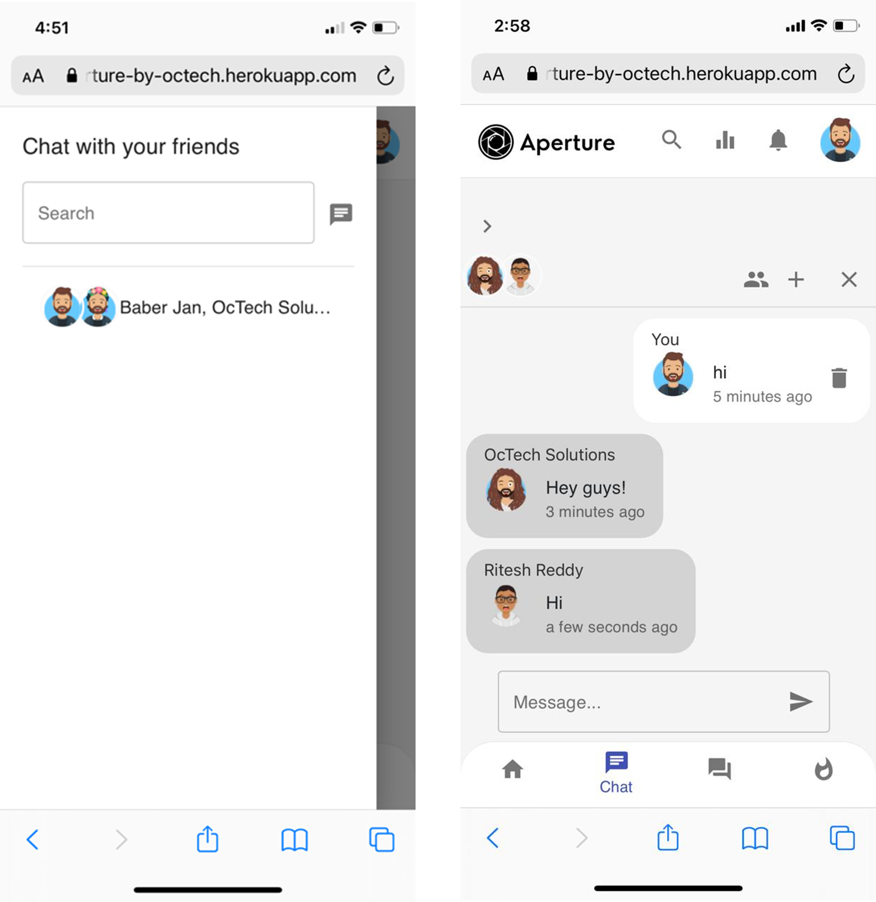
    

    <figcaption style="text-align:center;">
        Application Layout - Chat
    </figcaption>
</figure>

Users can also chat with their friends through the app’s chat functionality. Once two users are friends, they can start a chat with one another. If a user wishes he/she can chat with multiple friends at once using the group chat. They simply invite any additional friends they would like to chat to or create a new chat with more than one user.

<figure>
    

        
    

    <figcaption style="text-align:center;">
        Application Layout - Report Posts
    </figcaption>
</figure>

Users can reports posts that may contain content that contains inappropriate content by clicking the report post button at the top right corner of a post. 

<figure>
    

        
    

    <figcaption style="text-align:center;">
        Application Layout - Report Bugs
    </figcaption>
</figure>

If a user discovers a bug with the app, they are able to easily report that bug so that it may be brought to the attention of the development team and fixed. They do so by clicking on their avatar at the top right of the screen and navigating to the “Report a Bug” Page. A user can then attach the URL of the page where the bug occurred. They are also able to attach a screenshot of the bug to better illustrate it as well as provide a description of it.

<figure>
    

        
    

    <figcaption style="text-align:center;">
        Application Layout - Edit Avatar
    </figcaption>
</figure>

If a user is not happy with the way their avatar looks. They can easily edit the look of the avatar by clicking on their avatar at the top right of the screen and navigating to the “Edit profile” Page. They can then click on the Edit Avatar button which pops up and they are presented with the avatar customization screen again. They can re-customize their avatar and then click done once they are happy with the way it looks.

<figure>
    

        
    

    <figcaption style="text-align:center;">
        Application Layout - Delete Profile
    </figcaption>
</figure>

If a user decides that they would like to delete their account. They can do so by clicking on their avatar at the top right of the screen and navigating to the “Edit Profile” Page. This will ensure to delete all posts, comments and any content the user had on the app.

##### 3.2. Implementation Methodology 

*Iterations/Scrum/Other agile techniques?*

(William Malsam, 2018) (Alexandra Altvater, 2017) (Simplilearn, 2020) (Development That Pays, 2019)

For implementation and Project Management, it was decided that **Agile** would be the best approach for the following reasons...

- It allows for incremental development. A large application with many user interactions like Aperture would be best tackled by breaking it down into smaller components and then implementing each part one at a time, building up the complete application.
- It's iterative in nature. Iterations are an excellent way to schedule work as they establish a common system following which and a set time interval within which a functionality is to be implemented. 
- It grants adaptability. Agile allows components to be revisited and fixed or improved at later iterations. This means that if a system was not fully implemented in one iteration, the team need not be discouraged as they may have an opportunity to revisit unimplemented parts of it and finish them in the later iterations.
- Agile means that after every iteration, it is highly likely that a part of the application would be implemented, tested and available for review. This instills a sense of accomplishment in team members and product reviewer alike.

There are several agile frameworks out there like the Feature Driven Development, Lean Software Development etc. But, **Scrum** was chosen as best for this product due to following reasons ...

- It encourages good communication among members and requires great transparency within the group. As a team were majority of the members have no worked with each other before, scrum would ensure that all members are aware of all progress/disruptions and would aid in building an environment of trust.
- Presence of a scrum master to ensure that scrum is followed is a necessary force that can help ensure that every member contributes, are reminded to focus on the task at hand and are never lost as a result of scrum getting implemented well.
- Daily scrum reports are a great way to ensure that work is done regularly and wakes a sense of duty/responsibility in every member.
- Scrum has been proven to bring teams together towards a common goal. It is also very popular in the industry as is evident from large and successful tech companies like Google, Apple, Adobe etc, opting for this approach. As students who hope to enter the industry, it exciting to explore an implementation approach that is implemented by the titans of the tech world!

**The following is a diagram that depicts a sprint's structure.**

<figure>
    

        
    

    <figcaption style="text-align:center;">Sprint Structure (Development That Pays, 2019)</figcaption>
</figure>

**Note:** Above image "Sprint Structure" is from a sprint cheat sheet that can be obtained from the description of YouTube Video, ["Scrum Overview - [Scrum Basics 2019] + FREE Cheat Sheet" by "Development That Pays".](https://www.youtube.com/watch?v=RCJghFbXSPk&list=PLngnoZX8cAn9dlulsZMtqNh-5a1lGGkLS&index=1)

**This is how our sprints went ...**

- The implementation schedule took place in **sprints** where a single sprint would typically span **a week**. It was decided that a sprint would be short and just 1 week since that would allow for more opportunities to retrospect and identify what went right/wrong and what to fix. A stage of development was expected to be complete in 8-9 sprints which was indeed the case for all 3 stages of design & development. For the few sprints that were shorter than a week, some activities like building code was done in parallel to testing and producing documentation.
- Every sprint would begin with the **sprint planning meeting** on MS Teams / on rare occasions via chat and deciding what to put in our sprint backlog from our product backlog for the next week and what to focus on more.  product backlog was based off of the functional requirements that we had compiled features that the client absolutely required were marked as MUST and would be at the top of the product backlog and then other less important features would be in the middle and the bottom. Any functionality that was partially or done as a basic version would be in lowered in priority. 
- Based off of discussions, that night or latest by next morning which would be the 1st day of sprint. The scrum master would officially list down allocated tasks in the Scrum WhatsApp Group. The team would post **daily scrum reports** every morning with updates.
- At the end of each sprint we would have produced at least 1 or 2 **increments** in addition to few partially implemented functionalities or maybe 1 that was implemented but did'nt work out too well. These would be rescheduled for later.
- By now, it would be time for the weekly meeting with our line manager and all happenings of the scrum, future plans and increments would be presented. Often Dr. Hani Ragab, would give us good feedback and let us know what could improve. This meeting along with discussions that the team would have later after our line manager left would be a **scrum review**.  
- Later that evening the team would decide what to carry forward into the next sprint and how it could be done in a better way than in last sprint in a **sprint retrospection** session. 

This process **repeats** with an MS Teams sprint planning meeting again.

##### 3.3. Iteration Achievement History

*What was achieved in each iteration/sprint?*

Following are 3 tables that summarize all achievements from every sprint for stages 1, 2 and 3 respectively.

<figure>
	
    <figcaption style="text-align:center;">Achievements Summary Stage1</figcaption>
</figure>

<figure>
	
    <figcaption style="text-align:center;">Achievements Summary Stage2</figcaption>
</figure>
<figure>
	
    <figcaption style="text-align:center;">Achievements Summary Stage3</figcaption>
</figure>

##### 3.4. Testing Regimen 

(Synopsis, No Date)

*How was the final system tested for technical correctness?*

During the development of the application’s functionality throughout stages 2 and 3, every functionality was tested each time a new functionality was added into the application. Using firebase console, it would be possible to see the collections and documents in the database and check if the data entered was correctly stored and later, correctly retrieved from firebase as JSON objects.

 

<figure>
	

        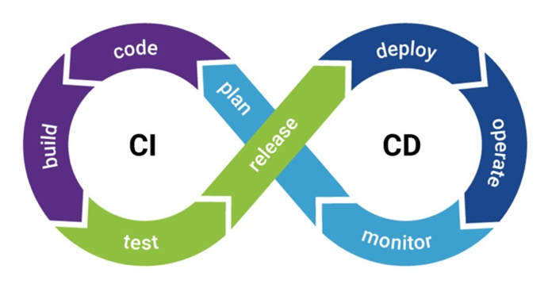
    

    <figcaption style="text-align:center;">
        Continuous Integration and Continuous Delivery (Synopsis)
    </figcaption>
</figure>

The testing method adopted is of **Continuous Integration & Continuous Delivery** (CI/CD) as per which, features are released by periodically integrating code changes into the main software branch, testing them as early and as frequently as possible, and incorporating feedback/fixing bugs and relaunching them. This continuous cycle of automating the product delivery pipeline ensures that features are made available to users quickly, efficiently, and sustainably. CI/CD makes for an un-compromising practice in the Agile software development and project management lifecycle.

Testing was also done across a variety of web browsers, in particular Google Chrome, Edge, Brave and Safari. The app was tested thoroughly at every point of development, for example login and sign-up functionality were very important features of the User Account System which had to be tested for accuracy and technical correctness concerning the new user entries made along with user details verification and user account verification. The Firestore database was frequently checked after every new user entry was made to ensure that the data stored was accurate and each user was correctly verified before logging in, and they completed their one-time email verification before they could login for the first time. 

Usability tests conducted via questionnaires ensured that different users tested our app and gave feedback. These opinions and feedback from stage was used to determine possible improvements and identify issues, that would be corrected for the final version.

<u>**Test Plan in Brief**</u>

The main objective of the test lies in testing the usability and the functionality of our application. Any needed change was made or attempted to be made for final system. 

The given feedback would highlight key areas for corrective action to take place and improve our application and high levels of usability as well as identify features that need to be added to the functionality and possible optimization.

<figure>
	

        
    

    <figcaption style="text-align:center;">
        Test Plan
    </figcaption>
</figure>

##### 3.5. Install - Setup - Maintain

*Documentation on how to install/setup/maintain the final system.*

###### 3.5.1. Installation

Our application is developed using React . So the client needs to have a JavaScript environment and a Package Manager so that we can download and install libraries including React.

**To install and build our application Aperture the client should follow these steps:**

- Download and install Node.js. The client can download Node.js from its official website : https://nodejs.org/en/ and follow the given instructions on how to install Node.js on their device.

- Use Node Package Manager to download and install required packages for the app. This is to     be done by :

  Running ***npm install --legacy-peer-deps*** command inside the project’s ***/octech*** folder . 

- Use Node Package Manager to deploy our app Aperture. This is to be done by :

  Running ***npm run build*** command inside the project’s ***/octech*** folder. This will create a build directory with an optimized production build of our app.

- Upload the ***build*** folder to the client’s HTTP sever.

- Serve the incoming user requests with ***index.html*** file inside the build folder.

  

###### 3.5.2. Set Up

**The client will have to set up:**

1. <u>**Firebase**</u>
   - Create a firebase account on https://firebase.google.com/
   - Create a firebase project and register our app by following Step 1 and Step 2 from [https://firebase.google.com/docs/web/setup#node.js-apps](https://firebase.google.com/docs/web/setup#node.js-apps)
   - Go to ***Authentication*** from ***Firebase console.***  
   - Open ***Sign-in Method*** tab and enable ***Email/Password*** and ***Google*** providers.
   - Go to ***Project Settings*** from the ***Firebase console***.
   - In the Your apps card, select the nickname of our app.
   - Select ***Config*** from the ***Firebase SDK*** snippet pane.
   - Copy the config object snippet and replace it with value of variable 
      ***firebaseConfig*** in ***/octech/src/firebase.js*** file in our project directory ***Aperture***.
   - Open ***Cloud Firestore*** from ***Firebase console***.
   - Go to ***Indexes*** *tab and create following **indexes** for the following* **Collections:**

<figure>
	

        
    

    <figcaption style="text-align:center;">
        Cloud Firestore Collections Indexes
    </figcaption>
</figure>

2. <u>**Google Map API**</u>

   - Sign In to the Google Cloud Platform Console on https://console.cloud.google.com.
   - Create a new project and enable the Google Maps JavaScript API for the project.
   - Copy the API key and paste it as the value of ***GoogleMapsAPI*** constant in ***/octech/src/components/Body/Map/client-config.js*** file.

3. **<u>GIPHY API</u>**

   - Create a developer account on GIPHY at https://developers.giphy.com/docs/api.
   - Create an API key for our app by clicking “Create an App” on the developer dashboard.
   - Copy the API key and paste paste it as the value of ***GiphyApiKey*** constant in ***/octech/src/components/Body/Feed/giphy-config.js*** file.
   - Upgrade the API to production level by clicking on ***Upgrade to Production*** button in the ***Developer Dashboard*** and complete the instruction that follow.

4. **<u>Time Based Job Scheduler</u>**

   - Setup a time based task scheduler on their server. The application will be different for different operating system e.g linux uses cron to schedule tasks.

   - Open ***Settings*** in ***Firebase console*** of your account. Then open ***Service Accounts.***

   - To generate a private key for you service account click on ***Generate New Private Key*** and then confirm by clicking ***Generate Key*** button.

   - It will ask you to download the JSON file containing the key. Securely store this JSON file.

   - Set the path of the JSON file as the ***argument*** to ***credentials.Certificate*** method in ***/timeBaseTasks/daily.py*** and ***/timeBaseTasks/monthly.py***

   - Setup daily task to run Python script ***/timeBaseTasks/daily.py***.

   - Setup monthly task to run Python script ***/timeBaseTasks/monthly.py***.

     

###### 3.5.3. Maintenance

We have developed the app such that the maintenance of the app will be effortless.

Throughout the development we have followed React’s file structure and naming conventions. So, to add a feature or fix a bug on the feed page we will go to the ***feed.js*** inside the ***/Feed*** folder of our app and do the required changes. All our code is well commented which makes the understanding of the code unchallenging.
 For general maintenance the client must do the following tasks :

- Check the ***bugReports***  collection of db. This contains information about the bugs or information of posts reported by the users. These bug reports should be analyzed and necessary actions should be taken.
- Use ***Firbase Analytics*** to track the engagement of the users with the app. This can be accessed by from ***Firebase console.***
- Use ***Firbase Crashlytics*** to prioritize and fix stability issues. This can be accessed by from ***Firebase console.*** 
- Use ***Firebase Overview*** to get insights on current read and writes to our database. This can be accessed by from ***Firebase console.***
- Create weekly global exciting challenges. 

***Octech Solutions* will be providing 3 maintenance packages to the client which include:**

1. <u>Base package</u> (1-year limited support): We will provide the first year of support for the product after its deployment for free. This will include providing security updates for the product. As well as providing patches for any bugs or instabilities that may arise.
2. <u>Extended package</u> (2-year support): Will provide the same level of support as the base package but, for two years. Will also work on a number of features that users or the client may want added to the product. 50 hours will be allocated throughout the 2 years (not including support and maintenance)     for adding extra features.
3. <u>Deluxe package</u> (3-year support): Similar to the extended package but, this time for 3 years. And 120 hours will be allocated for adding features to the product throughout the three years (not including support and maintenance).

Other details of these packages such as costing have been already given to client in the Project Costing section of the proposal document for our application “***Aperture***”.

##### 3.6. User Guide

*Short user guide.*

A playlist of videos that shall guide users in interfacing with the app can be found at https://www.youtube.com/watch?v=C_h5see_bmc&list=PLs9qIZvqLy07Z7S6l1bo7AAasd52wBHyV&index=1.

****

### 4. Project Evaluation

*Assess project as a whole.*  

This section, after an overall analysis of the the production process and final product, lays out organizational approaches taken, the development journey and value of the final product (includes descriptions of functionality achieved, limitations, unique elements and usability test results). 

##### 4.1. Organization

###### 4.1.1. Organizational Structure

*How was your group organized?*

The group was organized such that every member would contribute to all parts of design and development. 

Some possible languages/technical skills which would potentially be needed in the project was identified and members were required to grade themselves and assign points reflecting their confidence levels in these areas. This was a good exercise in ascertaining capabilities of team members that would prove crucial in assigning team roles.

<figure>
	
    <figcaption style="text-align:center;">Confidence Points</figcaption>
</figure>
In order to ensure optimum deployment of team members, a **SWOT analysis** was carried out.

<figure>
    

        
    

    <figcaption style="text-align:center;">SWOT Analysis Square</figcaption>
</figure>

Based on observations and after discussion, following roles were initially decided upon. However, it was decided that all members would contribute to all areas of developments. The allocated roles would mean that every member would oversee/guide activities that would fall under his/her role description.

- Baber Jan - Back-End Lead Developer & **Scrum Master**
- Gaurav Gosain - Front-End Lead Developer
- Gayathri Girish Nair - Programmer & Designer
- Hasan Kapadia - **Team Leader** & Database Lead Developer
- Mohamed M Elfarash - Programmer & Documentation In Charge
- Muhammad Assad Khan - Programmer & Report In Charge
- Tasneem Hussein - Graphic Design Lead & Programmer
- Yoshi Jasmin - Application Testing In Charge & Programmer

Towards the end of stage1, it was a collective decision to appoint Muhammad Assad Khan as the new leader as the previous leader was unable to fully commit to oversee the team due to personal issues. Later during stage 3, Baber Jan who is our scrum master, was appointed as the project manager/acting team lead since Assad was unable to contribute on account of having to stick to a recovery regimen following medical eye procedures. As we worked together, each members' true strengths surfaced and it became clearer where each member's primary capabilities were. 

Following is a categorization of members as per their primary aptitude adhering to **Honey’s 5 Team Member Types**. 

<figure>
	
    <figcaption style="text-align:center;">Honey's 5 Team Member Types</figcaption>
</figure>

- **Leader**: Ensures clear objectives, collective involvement and commitment.
- **Challenger**: Questions effectiveness, presses for improvement and results.
- **Doer**: Is practical, reminds team to keep moving and thereby drives team forward.
- **Thinker**: Produces carefully considered ideas and critically reflects upon other ideas/achievements.
- **Supporter:** Maintains team harmony and helps carry out/complete tasks.

That said, it was observed that collective efforts undertaken by the team led to all members qualifying to befit many of the above categories at various stages of design, development and documentation.

###### 4.1.2. Team Work

*Was the group organization successful? How well did your group collaborate?* 

Throughout development, all members were willing to collaborate and have always tried to produce good work. Even though members were allocated primary roles(see section 4.1.1), the group shared responsibility fairly equally. Challenging situations like when the leader was re-appointed and when the leader got sick was thus, less damaging and the team was still able to produce good work during these situations. 

Having members who had fine tuned programming skills as well as those who were proficient at organizing work, making plans, producing documentation, creating diagrams, critical analysis, coming up with designs and presenting content meant that the team was well balanced. This mix of skills allowed for members to compliment each other well.

A team member skilled at a particular task would guide others and draft a plan as to how to approach that task and all members would collaborate and contribute their portions to aid in completion of that task. A notable example of this system in action is the report generation process. One member who was skilled at organizing content, visualizing data and presenting information would be appointed to draft and oversee the report. This member would begin work on the report early on, decide what to put in it and appoint other members to contribute some parts of the report. Every member would submit their parts to the  report in-charge and this person would go on and compile the report, ensure uniformity and get it ready to submit. Since scrum was already used by the team in software implementation, it was decided that we would use scrum to produce documents, plans and the report by identifying their parts and dividing the work and monitoring our daily progress along the way in short sprints.

In all instances where one member had tried to implement a feature but failed/if it needed improvement, either another member would go ahead and complete that task or would act as a guide helping complete it. For example, the functionality of creating/deleting/sharing collections was implemented in stage 2 by a member. Whist functionality was achieved, it was a raw version with very basic CSS and styling. This was later in stage 3, improved by another member to adhere to the theme of the application. Also, by stage 3, the team had gained more experience and a member had implemented a new layout for image upload. Since this was superior to what was already in place, the team decided that this member would go ahead and replace the current mechanism in the app with this better one thus improving the overall quality of the application. 

*MORE ...*

###### 4.1.3. Overcoming Problems

*How did you handle any problems which arose?*

Following are few problems that the team had faced and methods that were adopted to combat them.

1. **Lack of Communication**

   <u>Problem</u>

   Since we intended on following the scrum framework that implements the agile approach of project management, it was required that 4 key meetings or in the situation of the COVID-19 pandemic, online meetings were to be held consistently to review work, share updates and make plans. It was observed early on that all members were unable to make it to these meetings on Microsoft Teams due to various issues (network related/health related/academic pressure). Although the team took efforts at having at least 1 meeting per sprint, 4 meetings (sprint planning meeting, daily scrum meeting, review meeting and retrospection meeting) was not taking place. After the 1st 2 sprints of stage 1, this issue was evident. It was recognized that since academic pressure would only increase as the semester progressed and that later stages (stage 2 and 3) being software implementation heavy, demanded following scrum with good, regular communication in order to successfully produce a working application. Thus, something had to be done.

   <u>Solution</u>

   Regular meeting are a key part of the scrum framework. It ensures that members are aware of the progress made, what to and by when to do it at all moments in development. It was decided that since the reasons for not being able to commit to meeting via MS Teams 4 times a sprint and daily for the daily scrum were legitimate an alternative approach to discuss needed topics, one that was sustainable and reliable in the long run had to be set.

   The team decided to create 2 specialized work only WhatsApp groups that would be a means of information exchange every day. The 1st group was a "Discussion" group where members were allowed to discuss any ideas / implementation techniques / problems faced with a tasks / possible solutions to problems with each other. The second group was called the "Daily Scrum" group were every member would report their daily scrum reports (what was achieved yesterday, what will be achieved today) every morning and the scrum master after having discussed with the group in previous MS Teams meeting as well as in the Discussion group, will assign tasks to each member at the beginning of a new sprint. The WhatsApp groups had the added advantage that chats could be exported and viewed to review discussions or decisions that were previously taken.

   Also, the team at this point decided to take 2-3 days time to learn to use GitHub well and push all work to our GitHub repository regularly.

2. **Unable to Find Files**

   <u>Problem</u>

   All stages of development involved production of various files (documents, images, excel sheets etc.). These files were shared via the WhatsApp discussion group and thus would get lost amongst conversation. This meant that files shared in the past were hard to find among conversations.

   <u>Solution</u>

   This problem was addressed though the simple yet effective decision to create one more WhatsApp group for the sole purpose of sharing files only. Web WhatsApp allowed file to be uploaded from and downloaded to our laptops/PCs with ease. Also, for parts of development that required a lot of common files like code/the report, it was decided that these files may also be stored on GitHub repositories where members can easily access and update them.

3. **Too much of a good thing, a bad thing?**

   <u>Problem</u>

   Because every decision was discussed and because every member always had inputs and wanted the best, there were often a lot of different approaches to solving a particular problem and clash of ideas/opinions was frequent. There was a tendency to overthink and get stuck thinking about details which would lead to decision paralysis and one idea could not be chosen over another as both would be possible ways to implement a feature.

   <u>Solution</u>

   Such problems became less prevalent as the team continued to work together. Soon there was more trust amongst members and one member simply trusted the other to implement the best possible solution to a problem. An understanding was reached where in it was decided that every member would try and implement their appointed feature within the sprint upholding minimum standards. If the member managed to finish the feature before the sprint ended then he/she would spend time improving it. Else, that member was to move on to the next task until there came an opportunity when this feature could be improved either by the same person who first implemented it or by someone else in a later sprint. Decision dilemmas would also be solved via voting or asking for the line manager's view.
   
4. **ReactJS Learning Curve**

   <u>Problem</u>

   ReactJS is a powerful tool as it allows for the creation of reusable components and implement complex html, javascript, css interation via JSX. But Learning it proved very difficult as concepts of states, life cycle functions, hooks etc in ReactJS in conjunction with google firebase services was hard to understand and grasp at enough depth to be able to achieve a functionality.

   <u>Solution</u>

   It was decided that trying to implement a feature with little knowledge would inevitably result in mistakes that would ultimately be costly. So, it was decided that it would be better in the long run for members to take up-to a week or two to learn React and how it works before implementing core functionalities/complex functionalities. This meant that some time would be lost and the pre-planned initial schedule for implementation designed in scrum 1 would not be able to be strictly followed. But the agile approach meant that later sprints could be tweaked to account for this necessity and hence the team proceeded to implement the simplest features / features using concepts grasped first before tackling more complex systems.

5. **Need to Update Database after Regular Intervals.**

   <u>Problem</u>

   For some parts of the app like challenges, there was a need to check after regular intervals say 24 hours, if whether a challenge was still open or not. In such scenarios an action such as loading of the challenges was what was used to trigger the checking. This is not the best was since if a challenge closed after 24 hours while a user was viewing already loaded challenges, then this change would not show up.

   <u>Solution</u>

   To combat this issue as well as to implement all other periodic testing like checking for user content / bug report regularly, an ubuntu server was leased and programmed to regularly do this.

*GIVE MORE DETAIL IN SERVER PART ...*

###### 4.1.4. Sticking To Schedule

*How successful were the timings in your original plan?*

The initial schedule drafted in Stage 1 was based off of speculated dates and approximations as to when we would have our demo, how long it would take to learn ReactJS, how successful we would be at implementing a particular core system within the application would be. These dates were not expected to be hit precisely as it was expected that not every iteration would result in a functional increment. Thus, there was quite a bit of deviation from the original plan as if a sprint resulted in partially implemented features then those would be pushed to next sprints and this would deviate from the original plan even more. 

<figure>
	
    <figcaption style="text-align:center;">
        Pre Planned Vs Implementation Schedule Observations Table
    </figcaption>
</figure>

From above table, it can be observed that the in stage 1, implementation of every Main Task saw an average deviation of 8 days per task, stage 2 of 6 days and stage 3 of 17 days. Note that this deviation takes into account both instances where in a task was started ahead of schedule, where one was stretched behind schedule and where one finished earlier. 

With this in mind, stage 1 was the most successful as it only had 1 main task that was completed behind schedule with a 12 day deviation and the other 2 tasks behind scheduled had a deviation of 6/only 1 day. 

Stages 2 and 3 however saw more deviation. This was expected as these stages involved more code implementation and few functionalities in almost every sprint would only be partially achieved or achieved at a very basic level needed improvement later. This would cause more deviation as dates for these tasks had to be reallocated.

The fact that the team had to take some time at the beginning of stage 3 to understand some more advanced ReactJS concepts like async functions, higher order components etc and some basic features that weren't yet fully understood better, led to the major deviation from the original plan. Moreover, our leader being unable to contribute due to medical eye procedures and thus a prescribed curb of screen time also led to few deviations.

The choice to adopt scrum and extra efforts by all members in stage 3 is what led to successful implementation of the application. All core functionalities that had remained was eventually implemented in iterations via revised implementation plans made after every sprint. 

This journey can be observed in detail in the 4.2.1 (Implementation Schedule) section of this report.

From this experience the team has reflected that the initial plan made in stage 1 had underestimated the learning curve that members had with respect to ReactJS and didn't have much wiggle room. Also, from above table it can be seen that 3 main tasks were added that were not accounted for in the initial plan. 

Opportunities for learning and completion that agile provided and the team's commitment to it made it possible to complete all planned tasks. In stage 3, it was observed that after the team took the time to learn and practice react, that in combination to the fact that the team was by now used to the scrum framework let to members being more productive. This boost in performance achieved though learning and cooperation is what led to a final finished product.

##### 4.2. Implementation

###### 4.2.1. Implementation Schedule

*What was your implementation schedule? How did the implementation schedule differ from the original plan?*

The implementation schedule drawn from the "**Aperture Project Diary**" can be viewed below in 3 tables. One for stage1, stage2 and stage3 respectively. The "Success Measure" column ranging from 1 to 3 stars depict how successful/effective at getting work done, each sprint was.

<figure>
	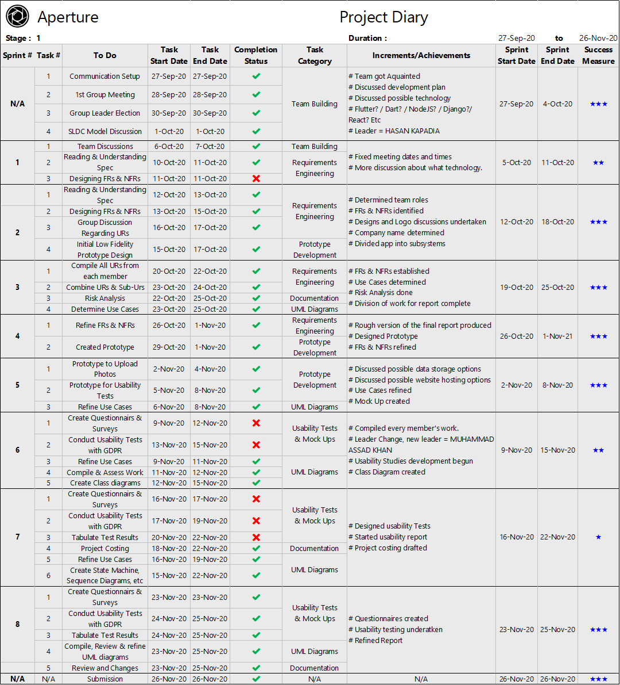
    <figcaption style="text-align:center">Project Diary Stage 1</figcaption>
</figure>

<figure>
	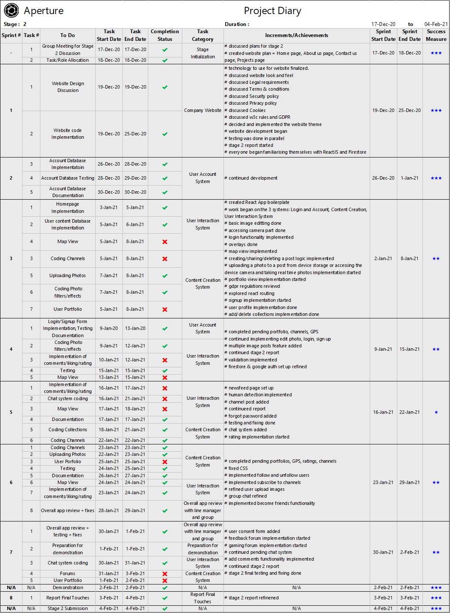
    <figcaption style="text-align:center;">Project Diary Stage 2</figcaption>
</figure>

<figure>
	
    <figcaption style="text-align:center;">Project Diary Stage 3</figcaption>
</figure>
It can be observed that stage 1 was successful for the most part with all functionalities tasks completed. Then stage 2 was less successful than stage 1 since there were more tasks that had to be rescheduled as can be seen from sprints 4 and 5. Also gaming and feedback forums could not be fully functional at the end of the stage. They were functional but were very basic versions with just basic functionality and no CSS styling at the end of stage 2. This did not meet the definition of "done" as this late stage in sprint 7 since only one sprint was left. Thus these 2 forums were with held from officially becoming part of the submitted version for stage 2 and became integrated into the application after being fully functioning at stage 3.

**Below are the charts with the plan for each stage made in stage 1. The dates from actual implementation schedule was added to this in order to view a comparison.**

<u>Notes to consider when reading the charts</u>

- The days marked in orange and blue are from the original plan with the orange dates corresponding to main tasks and blue ones to sub tasks.
- Similarly, all green/red colored squares stand for days from the actual implementation schedule that followed agile. Dark green squares correspond to main tasks and light green ones to sub tasks that were successfully implemented. Red squares show tasks that could not be implemented (the forums in stage 2).
- The rows colored a pale green are tasks that were added in the implementation plan and didn't exist in the original plan.
- The dates in green are dates from the original plan that was exactly hit by the dates from the implementation plan. and the red date are those that were not.

<figure>
	
    <figcaption style="text-align:center;">Implementation Comparison Chart Stage 1</figcaption>
</figure>

<figure>
	
    <figcaption style="text-align:center;">Implementation Comparison Chart Stage 2</figcaption>
</figure>

<figure>
	
    <figcaption style="text-align:center;">Implementation Comparison Chart Stage 3</figcaption>
</figure>

The above comparison chart data was used to extract the Pre Planned Vs Implementation Schedule Observations Table from section 4.1.4 (Sticking to Schedule).

###### 4.2.2. Path to Success

*provide examples*

*Was your implementation approach successful (scrum, other, etc)? Why or why not? Use specific examples from your experiences to support your discussion.* 

<u>Pros</u>

- Initially the team was very lost and awestruck at the massive task that lay ahead. This is when the decision to sit down and **identify systems** that would make up our application proved helpful. Initially 11 systems where identified which was then narrowed down to 6 ...

  1. User Account System
  2. Content Creation System
  3. User Interaction System
  4. Game Mechanics System
  5. Notification System
  6. Application Improvement System

  This breakdown of the application allowed the team to develop a wholesome view of what the application would look like and what it would be capable of. We then went on to tackle one system at a time, always beginning by identifying main tasks and implementing them.

- The **flexibility** that **scrum** provides allowed us to implement parts of the app that felt manageable at a given moment knowing that once the team had amassed further knowledge regarding a topic, those very basic versions first implemented in a previous scrum may be revisited, tweaked and refined in a later scrum.

- Having a **scrum master** that regularly discussed with the group and updated with allocated tasks on a weekly basis allowed for the team to always have **an idea about the next most important tasks.** At instances where the team was faced with an especially challenging system like the user interaction system with multiple components like creation/deletion of posts, collections etc, the fact that in an iteration one had to only address a small part of it led to the team being able to divide and conquer it.

- **Daily scrums**, **Scrum Reviews** and **Retrospection** were a constant reminder of just how much had been and were yet to be achieved every week. Any sprint tasks not achieved this week would be reallocated next week in addition to other tasks. This succeeded at keeping the team on toes and though at variable rates, **weekly sprints ensured that weekly progress was made**.

- Every sprint would culminate in all members reviewing and testing out functions implemented thus far before suggesting fixes/improvements that would be implemented in the next sprint if deemed necessary. These **implement > test > fix > implement next** iterations ensured that the team **produced working parts** of the application almost **every week** and it would be **unlikely** that these parts **would need to be changed later** on. This approach also meant that we would have a new working feature to show our line manager at nearly every meeting. 

- Opting **React JS** enabled the team to create **components** that could be **reused** and take advantage of **vast libraries and frameworks** that React supports like Material UI, React Bootstrap etc. Due to React being a popular choice amongst application developers, **finding** online **tutorials** and **reading material** on it **was not difficult**. 

<u>Cons</u>

- Opting **ReactJS** meant that most of the team had to take the **time to learn** its key features. This resulted in some time in our development journey (Scrums 1 & 2 of stage 3) getting dedicated to learning it. Also, lack of sufficient knowledge of how to achieve a particular task had resulted in slower progress than ideal at several points in Stages 2 and 3 corresponding to implementing complex systems like the user interaction system, game mechanics system and chat feature.

- The constant pressure to produce **daily scrum reports** was **at times overwhelming**.

- The team was always very active and driven to produce a great product. Every member had **lots of ideas/opinions** to make the application better. Whilst this meant no shortage of options, it also meant that it took **longer to reach a consensus** and would also lead to **disagreements** that had to be resolved from time to time. This scenario was especially prevalent during the **initial stages** of development when the team was just coming together. **By Stage 3**, however, the team was **united** and had understood strengths and the value of each member. 

  **For example...**

  - A debate as to whether to implement adding posts to challenges by allowing addition of previous posts to a challenge via tags as opposed to allowing new posts dedicated to a challenge to be created by a user that arose in stage 3, culminated in a well thought out blend of both ideas where old posts could be added to challenges via a copy of that post participating in the challenge whilst at the same time enabling users to create new posts exclusive to a challenge. 
  - A more trivial debate that occurred initially during stage 1 regarding how to represent requirements in the report (table/bullet points) lead to the team spending time discussing about a small detail. Few more similar less significant idea clashes occurred during stage 1.
  - This scenario shows how a debate that occurred in stage 3 led to constructive improvement of functionality compared to petty disagreements from stage 1 showing the evolution of the team from a ragtag ensemble of passionate students to a real team that's goal oriented and focused on the betterment of the product.

- Parts of the specification given were ambiguous and sometimes vague like when it was mentioned in that the system would enable users to provide feedback and leave comments, it is confusing because comments are feedback and no further explanation of what feedback ideally looks like here was mentioned. The team understood that such inexplicit areas of the report to be intentional opportunities to allow development teams to come up with unique spins on the application and chose to do just this.

Overall, it is safe to say that our approach was successful in helping keep the team close knit and productive. When problems arose, the team was able to rise to the challenge and brave though it. The milestones we set for ourselves and achieved via sprints, gave us a sense of accomplishment and was a source of motivation in our development journey.

*NEED SPECIFIC EXAMPES...*

###### 4.2.3. Tools Used

*Which languages, tools, and techniques did you use? How suitable were they?*

For project planning and keeping track of progress the following tools were used.

- GitHub was used for version control of all implemented software. It also provides a log of all progress throughout all stages of development.
- VS Code Editor was used as it can be easily integrated with git and makes pushing to and pulling from GitHub repositories easy.	

*MORE ...*

##### 4.3. Product

###### 4.3.1. Functionality Achieved / Failed to Achieve

*Report achieved functionality. Provide outline summary on functions and then give details. How many of your requirements did you meet? (Example = A table showing to what extent each of the numbered functional requirements have been completed.)* 

<figure>
	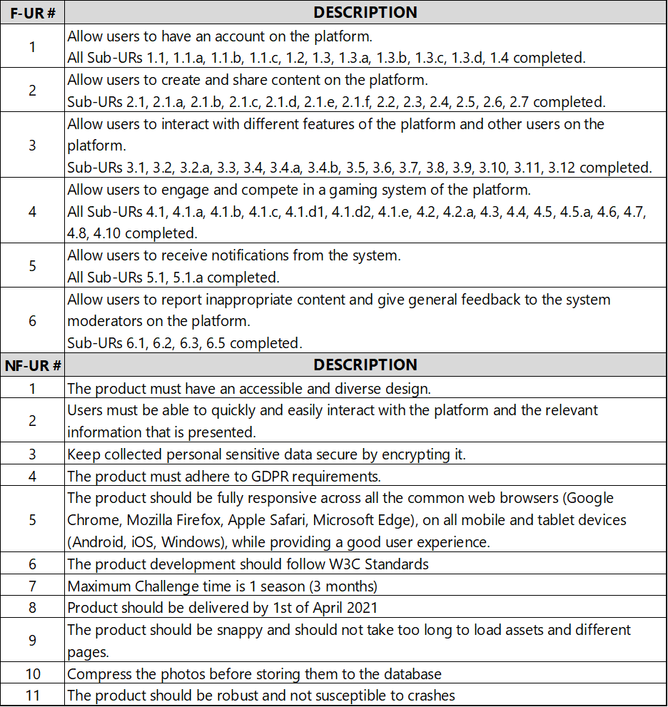
    <figcaption style="text-align:center;">
        Functionality Achieved
   	</figcaption>
</figure>

<figure>
	
    <figcaption style="text-align:center;">
        Functionality Failed to Achieve
   	</figcaption>
</figure>

In Summary, the vast majority of the Functional Requirements were implemented successfully. The few functionalities that could not be implemented were due to time constraints and upon considering priorities.

*Please refer to the Requirements Section of the Appendix to view FR and NFR descriptions in detail.*

###### 4.3.2. What's Special?

*What is particularly special about your product?  Have you included extra features? How robust is your final system?*

The App contains Set of Special Features which could be interesting for Users such as ones given below.

- **Image Flipping** **animation**. 

  Once Users Upload multiple images to their post they can Flip to the next image smoothly. 

- **Map View**. 

  Users can upload an image and add the GPS Coordinates to it, they will be able to see nearby Posts once they view the Map. 

- **Gaming Forum**

  Game players can share their photos of achievements, glitches, hints etc.

- **Feedback Forum**

  Users can share their photographs/posts to get some feedback possibly from professional photographers.

- **Collections** 

  Users can create a collection of posts of photos to showcase their collections/variety of photographs or challenge other collectors to take photographs of objects/animals around a particular theme. 

- **Portfolio**

  Photographers (both hobbyists and professionals) can create portfolios to exhibit their work. It provides an opportunity for users to advertise their best posts and images and users/clients looking for photographers might recruit talent or get recruited. 

- **Chat System** 

  Users can chat with their Friends and Create Group chats easily.

- **Toggle Public/Private Posts**

  Creator of a post can toggle the public/private icon on it to make it private/public.

###### 4.3.3. Bugs/Constraints

*Are there known bugs or constraints?*

Overall, our application is robust, there are currently no bugs that cause the system to crash.

However, there can be a problem with the Bug Report Functionality as some usability test participants encountered an issue while using our application on their phones where in the submit button went under the navigation bar and they found that the layout was overlapping with text fields. One other participant encountered an issue while logging in via phone as once the user refreshed the page the user got logged out. Also, few participants reported that they were able to upload human pictures **“Partially”**. Finally, a user wished that profile picture could also be edited along with other profile points.

To increase the robustness and the overall reliability of the application, most of the reported issues were fixed and taking into consideration a user's wish to edit the his/her profile pic, this was also made possible. 

*GAURAV, PLEASE REVIEW ...*

###### 4.3.4. Usability Test Results

*How usable did your subjects find the final system? Include a brief summary of results.* 

Overall, Aperture received an average usability score of 8.08 out of 10. Most users agree that the app is easy to use, and that they had fun using our application. 

Few users found it difficult to navigate through the app and found the chatting system a bit complicated. Also, a lot of users suggested having dark mode in the application as it will be more visually appealing.

The application was improved from the original mock-ups in stage 1. The color scheme and the layout was also changed with extra features added.  User feedback has presented us with few bugs to fix and improvements to make. Aperture will continue to improve the system and make sure that all suggestions from users and clients alike are taken on board and considered for future releases.

As a result of these findings, we have successfully achieved the vast majority of the Functional and Non- Functional requirements of the final Application. 

*Please refer to the Usability Evaluation Section in the Appendix for the Usability Test Plan more data and statistics.*

##### 4.4. Project Evaluation Reflection

**The experience** of developing an app from scratch was an incredible one. Working in a team consisting of people with whom one has never worked before was a unique experience for every member. The team was familiar with the process of developing code from experience gained through the course of their academic life and otherwise. But handling project and team management was a new experience and thus was the most challenging part of the project.

**What went well?**

- The decision to adopt agile and follow scrum was what ultimately helped account for unexpected outcomes and events and still produce a good, finished product at the end. The power of this approach was truly realized.
- Group collaboration went well. Every member contributed to almost every area of development. Regular brain storming sessions via chat both bought the team closer and led to great ideas for the application.
- The choice to use ReactJS whilst resulting in a learning curve, was still a good one. It allowed for members to create a common component that could be reused in the app. Also, availability of great learning material and many ReactJS compliant libraries and APIs made it possible for the team to develop skill in it and helped to avoid scenarios wherein one had to create every component from scratch.
- The decision was made to use Material UI framework.  A lot of thought was put into the look and feel of the application. This was reflected by positive comments regarding the overall feel of the app in that it was "simple and clear" etc, as can be seen from what users liked most in the Usability Evaluation part in the Appendix.

**What could have gone better?**

- Testing was done after each sprint. All members would simply test their newly implemented code for robustness and correctness. Then each member would do the same after combining the new functionality with the old. Then members would test each others' parts before finally combining them all and testing the whole thing together. This was effective. Few bugs were reported by users during usability tests. But having developed a more elaborate test plan may have helped us to do this testing more efficiently and in lesser time.
- More thought could have been put into the system architecture. Although a basic high level overview was drafted with sub-systems identified and UML diagrams created to aid in understanding them better. More emphasis could have been made on more specific components of the application and how they interact with each other. Scenarios where in similar components like a post component was implemented twice in different regions of the app (main post & challenge post) while instead they could have shared common features and drawn from the same component could have been avoided. Moreover having a detailed components overview would prove useful for the client or any other third party to understand the application better. 
- Usability testing for stage 3, could have been done a bit earlier giving more time to implement features that users would like to see. Nonetheless, some requested features like allowing for editing of profile pics after profile relation was still implemented at the end of stage 3.
- While preventing download of post images was an effort at ensuring no copyright violations, the team realizes that not enough thought was put into the legal aspects of the app like "What would the status of a posted image be in terms of the post creator's copyright regarding it?". 

**Identified means of amendment**

- In the event wherein Aperture would be a continuing project, the team hopes to first create a more detailed overview of its components and their relationships with each other. The organized code structure would be used to reverse engineer a detailed overview that would then be inspected for scope of improvement. Once improvements are made, these may be reflected in code. This overview would then be shared with the client thus allowing him/her/them to fully grasp the underlying structure of Aperture. This would also come in handy whilst trying to pinpoint the location of a bug within the application.
- Usability tests would be conducted right after a working version is available in order to determine possible upgrades/fixes.
- After discussion with a legal adviser, a copyright policy that Aperture shall set for its users would drafted. A possible idea could be to allow users to set the copyright license for each post as they create/edit it which would be stored in the database and use of post images would be exercised accordingly.
- A detailed Test Plan would be drafted and established such that development of all future versions of Aperture would follow this plan.

****

### Conclusion

The aim and objective of this document was to highlight all the functionalities completed within the stage 3 deadline and our implementation of all functionalities thus far. 

In spite of the challenges posed by the COVID-19 Pandemic and the time constraints there in, we at OcTech Solutions have completed all required requirements as specified by the client with regards to all 6 systems comprising Aperture along with supportive additional functionalities. 

Aperture has grown into a successful social media platform where users may both wind down and enjoy sharing photos with each other/showcase their talents and compete with each other in challenges for a thrilling time!

We believe that all the requirements as laid out by the client and his associates have been met. In the future, we hope to upgrade and expand operations of maintenance to cope with the heavy traffic flow through our servers and the databases needed to accommodate new influx of users every day. The concept of "playification", as specified by our client, has more potential than initially thought by our software development and design team, we feel that the meaningful interactions between people because of this feature and this application is the cornerstone of Aperture!

We at Octech Solutions are ready to Keep Developing the application, and we have the resources to ensure Aperture becomes a global icon.

Visit our company website to find more information about the future of Octech solutions and the amazing team behind it at https://octech.herokuapp.com/.

Visit our deployed Aperture web application as well which is now also a progressive web application on all mobile phones and tablets at https://aperture-by-octech.herokuapp.com/.

****

### References

**Andy. (2020, April 4).** A quick discovery of react-redux-firebase for user authentication. Retrieved from A quick discovery of react-redux-firebase for user authentication Website: https://dev.to/andytq/a-quick-discovery-of-react-redux-firebase-for-user-authentication-11gb

**Contributor, G. (2018).** 4 key benefits of using Firebase for mobile app development. Retrieved Jan 2021, from https://hub.packtpub.com/4-key-benefits-of-using-firebase-for-mobile-app-development/

**Github. (2015, August 29).** Redux/ReduxJS. Retrieved from https://github.com/reduxjs/redux/issues/653

**Stevenson, D. (2018).** What is Firebase? The complete story, abridged. Retrieved Jan 2021, from https://medium.com/firebase-developers/what-is-firebase-the-complete-story-abridged-bcc730c5f2c0

**Synopsys. (No Date).** CI/CD from https://www.synopsys.com/glossary/what-is-cicd.html.

**William Malsam. (2018, Sep 18).** What Is a Scrum Master? Here’s Everything You Need to Know from https://www.projectmanager.com/blog/what-is-a-scrum-master-everything-you-need.

**Alexandra Altvater. (2017, Sep 17).** "What is Agile Methodology? How It Works, Best Practices, Tools" from https://stackify.com/agile-methodology/#:~:text=Examples%20of%20Agile%20Methodology,pick%20one%20or%20two%20methods.

**Organize Agile. (2016, Jul 11).** YouTube Video, "Scrum in under 5 minutes" visit at https://www.youtube.com/watch?v=2Vt7Ik8Ublw

**Simplilearn. (2020, Feb 27).** YouTube Video, "Agile Project Management Tutorial | What Is Agile Project Management? | Simplilearn" visit at https://www.youtube.com/watch?v=thsFsPnUHRA

**Development That Pays. (2019, Jan 24).** "Scrum Overview - [Scrum Basics 2019] + FREE Cheat Sheet" and 7 more videos in playlist. Visit at https://www.youtube.com/watch?v=RCJghFbXSPk&list=PLngnoZX8cAn9dlulsZMtqNh-5a1lGGkLS&index=1

**John Prabhu. (2019, Jul 18).** "MVC Architecture & Its Benefits in Web Application Development". Visit at https://techaffinity.com/blog/mvc-architecture-benefits-of-mvc/

****

### Appendix

 *Appendix of Supporting Documentation. Any other supporting documentation that might be relevant (Examples = project diaries/report, original implementation plan, marketing material, etc).*

#### Requirements

**<u>FUNCTIONAL REQUIREMENTS</u>**

**F-UR1 : Allow users to have an account on the platform** 

**F-UR1.1:** Allow Users to Sign UP (M) Details Required for Sign Up: 

- Name
- Username
- Email
- Password
- Contact Number 
- Profile Picture which can be pre-defined avatar picture or their own uploaded photo for which they must give consent to the system 

**F-UR1.1a:** Validate the User Details (M) Verify: 

- Username is unique 
- Email address 
- Password meets the minimum requirements 

**F-UR1.1b:** Have pre-defined avatar pictures for users to choose as profile picture (S)

**F-UR1.1c:** Give consent forms to user to allow them to upload photo as their profile (S) picture

**F-UR1.2:** Allow Users to delete their profile (M) Users have the option to permanently delete their profile and erase all their data 

**F-UR1.3:** Allow Users to Login (M) User can login with username/email and password or via their Google account 

**F-UR1.3a:** Validate Login Details (M) Crosscheck input login details with the details in the Database 

**F-UR1.3b:** Allow user to reset password (M) Gives the option for user to reset password, if a user has forgotten their password 

**F-UR1.3c:** Allow user to view their own account details (M)

**F-UR1.3d:** Allow user to edit their own account details (M) User can update their profile details like name, password, display picture etc.

**F-UR1.4:** Allow user to logout (M)  

**F-UR2: Allow users to create and share content on the platform**

**F-UR2.1:** Allow Users to upload photos of objects or animals on the platform (M)

**F-UR2.1a:** Enable users to upload real-time pictures taken directly from their (M) device camera.

**F-UR2.1a****1:** Access the device camera (M)

**F-UR2.1b:** Enable users to upload photos from their device storage (M) 

**F-UR2.1b1:** Access the device storage (M)

**F-UR2.1c:** Allow users to associate GPS data with photos (S) Users can choose to use GPS to tag the location in their photos while uploading it 

**F-UR2.1d:** Allow users to add caption to their photos (M) Users can add a small description about the photo while uploading it. It can include model and settings of the camera that was used to take the photo 

**F-UR2.1e:** Allow users to tag objects or public events in their photos (M) Users can associate a specific keyword to an object in the photo or an event to start/participate in the event

**F-UR2.1f:** Allow User to modify photo while uploading them (M) While Uploading a photo user can choose to 

- Apply different photo filters 
- Generate GIFs 
- Add Stamp Overlays 

**F-UR2.2:** Allow users to share a post of photos (M) A post must contain one photo but can have up-to 10 photos. User can share post on their own 

- Profiles
- Portfolios
- Collection

User can share on gaming or feedback forum. Challenge Creator can share a post on their channel Challenge participator can share a post on the challenge.

**F-UR2.3:** Allow users to delete an uploaded post (M) User can delete their post from their own 

- Profiles
- Portfolios
- Collection

User can delete their uploaded post from gaming or feedback forum Challenge Creator can remove their post from their channel Challenge participator can remove their post from the challenge.

**F-UR2.4:** Enable users to create channel (M)

Users can create channel and will be the channel creator for that channel. Channel will include the following details 

- Channel Description 
- Channel Theme 
- Channel Creator 

**F-UR2.5:** Enable channel creator to delete their channel (M)

**F-UR2.6:** Enable users to build/remove portfolios (M) Photographers (both hobby and professional) can create portfolios to exhibit their work. An opportunities page where users can advertise their best posts and images and users/clients looking for photographers might recruit talent or get recruited through it 

**F-UR2.7:** Allow users to create/delete collections of photographs (M) Create collection of posts of photos to showcase their collections/variety of photographs or challenge other collectors to take photographs of objects/animals around a particular theme 

**F-UR2.8:** Enable users to run/organize public events (S) User can start a new tag of events creating a new event and other users can participate by tagging the events in the photos related to the event 

**F-UR3: Allow users to interact with different features of the platform and other users on the platform** 

**F-UR3.1:** Allow users to chat with other users (M) Users can chat with other users or a group of other users on the platform 

**F-UR3.2:** Allow users to rate post of other users (M) Users can give up to 3 stars to a post of other users. Users can re-rate a post

**F-UR3.2a:** Update user profile points based on ratings of their post (M) When a user receives a rating on their post that will be added to their total profile points. 

**F-UR3.3:** Allow users to comment on post or delete their comment from a post (M) 

**F-UR3.4:** Allow user to send or cancel friend requests to other users (M) 

**F-UR3.4a:** Allow user to accept or ignore friend requests of other users (M) 

**F-UR3.4b:** Allow user to remove their friends (M)

**F-UR3.5:** Allow user to block or unblock other users (M)

**F-UR3.6:** Enable user to follow or unfollow a channel (M). Users can follow a channel and then can see posts from that channel on their news feed.

**F-UR3.7:** Have a feedback forum (S) A forum for users to get feedback about their posts from other users (mostly professional photographers). Users can give/delete their feedback on posts on feedback forum to help other users improve their photography skills.

**F-UR3.8:** Have a gaming forum where users can post hints and glitch about a game (C) Users can share posts about hints and glitches about any game on the gaming forum. 

**F-UR3.9:** Allow user to search for user/channel/challenge (M)

**F-UR3.10:** Allow Users to checkout user profiles/ channels (M) User can explore a profile of other user to view their profile details and their shared posts or can explore a channel and can view all its posts.

**F-UR3.11**: Have an image feed for each user (M) Each user will have a news feed that will show them: 

- Posts from their friends 
- Posts from the channels they follow 

**F-UR3.12:** Have a map view of that will show all the photos near the location of the user (C) Will display a map with all the photos near the location of the user. This is called ‘Photo Map’. 

**F-UR3.13:** Make recommendations to platform users about channels they might be (W) interested in. Have an AI embedded in our system that will give suggestion to the users about the channels they might be interested in based on their likes on their home Image feed. 

**F-UR4: Allow users to engage and compete in a gaming system of the platform**

**F-UR4.1:** Allow users to create and delete challenges (M) Users can create challenges for other users to take photos around a particular theme or a particular location for a fixed amount of time. Challenge creator can add hints about the challenge to help other users complete the challenge.

Challenges can be: 

1. Private: Users can only join through invitation from the challenge creator 
2. Public: Anyone on the platform can participate. These can be accessed under game section.

Challenge creator can delete their challenge anytime and the challenge creator can delete maximum of 3 challenges in a week.

**F-UR4.1a:** Have a challenge section (M) Challenge section would display the user all the active challenge he/her has participated in and would feature all the public challenges.

**F-UR4.1b:** Allow challenge creator to invite other users to participate in their (M) private challenge 

**F-UR4.1c:** Allow users to take part in challenges (M) Users can take part in a challenge by

- Accepting the invite (Private Challenge) 
- Joining the challenge from the game section (Public Challenge) 

**F-UR4.1d:** Have a leader board for the challenge (M) Users with highest rated photos will be featured in the challenge leader board 

**F-UR4.1d1:** Show user's position compared to the rest of the users' in the (S) challenge leader board 

**F-UR4.1d2:** Update challenge leader board (M) Update leader board when there is a change in the rating of any photo in the challenge.

**F-UR4.1e:** Give points and achievements to the winners of a challenge (M) Users with the top 3 position in the challenge will receive extra points on their profile and achievement certification as photo so they can share on the platform 

**F-UR4.2:** Have a Global leader board for users (S) Users will be ranked globally based on their profile points 

**F-UR4.2a:** Show user's position compared to rest of users' in global leader board (S) Display the ranking of the user in the global leader board 

**F-UR4.3:** Have a Global leader board for posts (S) The leader board will show top 10 rated posts 

**F-UR4.4:** Update Global leader board daily (S) Update global leader boards daily at 00:00 GMT 

**F-UR4.5:** Give badges to users at the end of the Season (C) Users will receive badges according to their leagues 

-  Diamond = Diamond Badge 
- Platinum = Platinum Badge 
-  Legendary = Legendary Badge 
- Champion will get a Champion Badge 

**F-UR4.5a:** Reset profile points after every season (C) Reset the profile points of all the users after a 3-month long season ends 

**F-UR4.6:** Allocate users into leagues based on their points (C) Users will be placed into a specific league based on their profile points 

-  100 - 500 = Silver League 
- 500 - 1000 = Gold League 
- 1000 - 1200 = Diamond League 
-  1200< = Platinum League 
- Top 100 = Legendary League 
- 1st = Champion 

**F-UR4.7:** Announce the fastest growing channel of the month (C)

**F-UR4.8:** Allow moderator to create weekly public challenge (C) 

**F-UR4.9:** The App could feature a "my adventures" view where users can share their (W) adventure stories, interesting experiences and thoughts that occurred to them on their photography journey 

**F-UR5: Allow users to receive notifications from the system**

**F-UR5.1:** Have a notification section (S). Users could view their notifications in the notification section. 

**F-UR5.1a:** Send notifications to user (S) Notify users on 

- Chat Notifications 
- Channel managers will get notified when their channel gets followed 
- Channel which they follow uploaded a photo 
- Starting of events 
- Feedback received 
- Comments 
- Rating 
- Update on reports 
- Profile Points 
- New Challenge in their area 
- Invitation received for a challenge 
- Challenge finished 
- Badges and achievements 

**F-UR6:  Allow users to report inappropriate content and give general feedback to the system moderators on the platform.**

**F-UR6.1:** Allow users to report a post or comment on a post with inappropriate content (M) Users can report a post if it has a photo which contains a human in it, or they think it is inappropriate for viewership by filling the report form. User can report a comment on a post if they find it inappropriate 

**F-UR6.2:** Allow users to report bugs in the app (M) Users will report if they find any bug in our app by filling the report form 

**F-UR6.3:** Have system moderators to analyze report forms (M) The system moderator will review reported forms and take necessary actions 

**F-UR6.4:** Produce summary report for system moderators concerning overall platform (C) usage. 

**F-UR6.5:** Have an AI system that performs automated photo filtering (C) Have an AI embedded in our system that will remove posts that have photos with humans in it.

**<u>NON-FUNCTIONAL REQUIREMENTS</u>**

**NFR-1:** The product must have an accessible and diverse design

**NFR-2:** Users must be able to quickly and easily interact with the platform and the relevant information that is presented

**NFR-3:** Keep collected personal sensitive data secure by encrypting it 

**NFR-4:** The product must adhere to GDPR requirements 

**NFR-5:** The product should be fully responsive across all the common web browsers (Google Chrome, Mozilla Firefox, Apple Safari, Microsoft Edge), on all mobile and tablet devices (Android, iOS, Windows), while providing a good user experience.

**NFR-6:** The product development should follow W3C Standards 

**NFR-7:** Maximum Challenge time is 1 season (3 months) 

**NFR-8:** Product should be delivered by 1st of April 2021 

**NFR-9:** The product should be snappy and should not take too long to load assets and different pages. 

**NFR-10:** Compress the photos before storing them to the database

**NFR-11:** The product should be robust and not susceptible to crashes 

****

#### Usability Evaluation

<u>**Introduction**</u> 

This document outlines the details for carrying out the usability tests for the Aperture application and the experiment tabulated results.  This document aims to highlight areas of improvement to the development team and flaws in the core functionality and system implemented in the final Application.

**The stakeholders of this document include but are not limited to:** 

1. The client and their representatives who fully understand the need for this experiment carried out to meet an intuitive and high usability system's demands.
2. The development team who hope to study the feedback provided and correct any design flaws pointed out to create an intuitive and user-friendly system. 

Due to the prevailing COVID-19 pandemic, no test will take place face to face. Instead, an online consent form, questionnaires, and a Link to the Application will be provided to the test subject so that the subjects can answer the questions provided. 

<u>**Scope**</u> 

There is one software application – Aperture. 

It is vital that the Application is deployed and performs well in all common web browsers such as Google Chrome, Mozilla Firefox, Apple Safari, Microsoft Edge on various operating systems such as IOS and Android. Each user will have their interface and newsfeed tailored to them, which will give the user an immersive and delightful experience. 

Each system relies on an intuitive and a visually appealing yet interactive graphical interface which ensures that: 

1. Each user has an enjoyable experience with the application and will continue to use it for a healthy extended period of time. 
2. Everything is presented clearly and easily to use for people with various levels of computer literacy.

<u>**Participants**</u> 

We expect to have 8-13 subjects from various demographics and computer literacy backgrounds. Ideally, subjects would be of legal age with knowledge of social media applications and varying degrees of knowledge in photography. It is expected that subjects who are our target users would provide more in-depth feedback regarding the application. Possible users include photographers, collectors, environmentalists, zoologists, architects, historians, academics, hobbyists, and video gamers. 

<u>**TEST PLAN**</u> 

A test plan contains all techniques and methodologies used to carry out the usability experiment, the different types of data to collect, how data is to be analyzed, the feedback received to improve our application and participant details like demographic, age, computer literacy etc. 

**Task Scenarios** 

| Questions | Related Requirements                                         |
| --------- | ------------------------------------------------------------ |
| Q7        | **FR-3.1:** Allow users to chat with other users **(M)**. Users can chat with other users or a group of users on the platform |
| Q8        | **F-UR3.2:** Allow  users to rate post of other users **(M)**. Users  can give up to 3 stars to a post of other users. Users can re-rate a post.                                                                             **F-UR3.2a:**  Update user profile points based on ratings of their post **(M)**.When a user receives a rating on their post  that will be added to their total profile points.                     **F-UR3.3:** Allow users to comment on post or delete their comment from a post **(M)**. |
| Q9        | **F-UR5.1d:** Have a leader board for the challenge(M). Users with highest rated photos will be featured in the challenge leader board.                                                                                  **F-UR5.1d1:** Show user's position compared to the rest of the users in the challenge leader board (S).                                                                                                                                            **F-UR3.1d2:** Update challenge leader board(M). Update leader board when there is a change in the rating of any photo in the challenge. |
| Q10       | **F-UR3.11:** Have  an image feed for each user(M) Each user will have a news feed that will show  them posts from their friends and posts from the channels they follow.                   **F-UR3.12:** Have  a map view of that will show all the photos near the location of the user (C). Will display a map with all the photos near the location of the user. This is called ‘Photo Map’. |
| Q11       | **F-UR4:** Allow users to engage and  compete in a gaming system of the platform. |

Task scenarios will receive a rating out of 7, from strongly agree to strongly disagree, on the ease of performing specific tasks and navigating throughout the application. On completing said tasks, the test subject will indicate whether they found the task easy to complete or difficult. This will pinpoint specific areas which need to be fixed and improved in the application. 

Other questions will be a Likert scaling for the overall intuitiveness, ease of use, understanding, and the app's overall rating. Some questions will also prompt the subjects to provide their thoughts and feedback on the application's overall functionality, and they were also asked if they could provide any suggestion on further improving the functionality and overall usability of the app.

**Metrics**

Metrics include subjective quantitative data to be collected in each test subject’s rating of the application using the Likert rating scale on multiple features and functionalities regarding the application. For the overall application, we shall also request subjects to rate the app out of 10 and then provide descriptive qualitative feedback, which will give us targeted feedback about specific features of the application that the subjects liked or disliked. 

***Please refer to the Appendix for documents like pre-test and post-test questionnaires, consent form, complete prototype mock-up etc.*** 

**<u>TEST PROTOCOL</u>**

The test protocol maps out the flow of events the test subject undertakes to evaluate our application's usability in a real world scenario. The qualitative and quantitative data collected from the questionnaires and how each subject successfully interacted with the application will help the development team improve the application. 

**The following text and questionnaires were presented to users.**

**Aim** 

The aim of this experiment is for you to try our newly designed Application known as **"Aperture."** The application is a new social media platform to interact and upload photos, create portfolios, create collections, and interact with other users while taking part in an implemented gaming aspect consisting of challenges, leader boards, and awards given for achieving a certain number of points. Your privacy is essential to us, and all data will be kept anonymous and confidential. The feedback you provide will give us critical insights regarding the usability and level of the application's intuitiveness, which will up us create a seamless and enjoyable experience

**Introduction** 

First, you will be asked to complete a survey form before the test. it is provided to you. You will be asked to navigate through the Application, answer questions based on excerpts from the Application, and complete simple tasks mentioned in the questionnaire. This study is intended to improve our application only, and no data will be shared with any outside or third-party source. Your privacy is important to us, and your responses will remain anonymous and confidential, so they cannot be traced back to you in any way. 

After the test is complete, we will be grateful if you can complete an anonymous questionnaire to collect more feedback for the application. 

There is no correct or incorrect answer in the test. Feedback provided based on your interpretation will help us improve the user experience of the application.

**Questionnaire**

**Please test the application before attempting the Questions:**

[**https://aperture-by-octech.herokuapp.com/**](https://aperture-by-octech.herokuapp.com/)

**Q1. The App is easy to use** 

1. Strongly Agree 
2. Agree 
3. Somewhat Agree 
4. Neither agree nor disagree 
5. Somewhat Disagree 
6. Disagree 
7. Strongly disagree 

**Q2. The Design and layout of the App were clear and understandable.** 

1. Strongly Agree 
2. Agree 
3. Somewhat Agree 
4. Neither agree nor disagree 
5. Somewhat Disagree 
6. Disagree 
7. Strongly disagree 

**Q3. The App layout is logical** 

1. Strongly Agree 
2. Agree 
3. Somewhat Agree 
4. Neither agree nor disagree 
5. Somewhat Disagree 
6. Disagree 
7. Strongly disagree 

**Q4. The App is responsive and user friendly** 

1. Strongly Agree 
2. Agree 
3. Somewhat Agree 
4. Neither agree nor disagree 
5. Somewhat Disagree 
6. Disagree 
7. Strongly disagree 

**Q5. It is difficult to navigate through the App** 

1. Strongly Agree 
2. Agree 
3. Somewhat Agree 
4. Neither agree nor disagree 
5. Somewhat Disagree 
6. Disagree 
7. Strongly disagree 

**Q6. The App visually appealing** 

1. Strongly Agree 
2. Agree 
3. Somewhat Agree 
4. Neither agree nor disagree 
5. Somewhat Disagree 
6. Disagree 
7. Strongly disagree 

**Q7. I can easily send and receive messages from my friends**

 **(**[**https://aperture-by-octech.herokuapp.com/**](https://aperture-by-octech.herokuapp.com/)**)** 

1. Strongly Agree 
2. Agree 
3. Somewhat Agree 
4. Neither agree nor disagree 
5. Somewhat Disagree 
6. Disagree 
7. Strongly disagree 

**Q8. I can like and comment on uploaded photos** 

**(**[**https://aperture-by-octech.herokuapp.com/**](https://aperture-by-octech.herokuapp.com/)**)**

1. Strongly Agree 
2. Agree 
3. Somewhat Agree 
4. Neither agree nor disagree 
5. Somewhat Disagree 
6. Disagree 
7. Strongly disagree 

**Q9. I can easily view the Leaderboards and view my current point status.** 

([**https://aperture-by-octech.herokuapp.com/**](https://aperture-by-octech.herokuapp.com/))

1. Strongly Agree 
2. Agree 
3. Somewhat Agree 
4. Neither agree nor disagree 
5. Somewhat Disagree 
6. Disagree 
7. Strongly disagree 

**Q10. I can easily view map location of the photo**

([**https://aperture-by-octech.herokuapp.com/**](https://aperture-by-octech.herokuapp.com/))

1. Strongly Agree 
2. Agree 
3. Somewhat Agree 
4. Neither agree nor disagree 
5. Somewhat Disagree 
6. Disagree 
7. Strongly disagree 

 

**Q11. I can easily create and participate in a challenge and invite my friends.**

([**https://aperture-by-octech.herokuapp.com/**](https://aperture-by-octech.herokuapp.com/))

1. Strongly Agree 
2. Agree 
3. Somewhat Agree 
4. Neither agree nor disagree 
5. Somewhat Disagree 
6. Disagree 
7. Strongly disagree 

Please state your level of agreement: https://aperture-by-octech.herokuapp.com/

**Q12. I can easily create a collection of photos and add an uploaded photo from Different user to my collection.** 

1. Strongly Agree 
2. Agree 
3. Somewhat Agree 
4. Neither agree nor disagree 
5. Somewhat Disagree 
6. Disagree 
7. Strongly disagree

 

**Q13. I can easily create a portfolio to showcase my best work.**

1. Strongly Agree 
2. Agree 
3. Somewhat Agree 
4. Neither agree nor disagree 
5. Somewhat Disagree 
6. Disagree 
7. Strongly disagree

 

**Q14. I can report a Bug or inappropriate content in the app easily.**

1. Strongly Agree 
2. Agree 
3. Somewhat Agree 
4. Neither agree nor disagree 
5. Somewhat Disagree 
6. Disagree 
7. Strongly disagree

 

**Q15. I can easily tag photos**

1. Strongly Agree 
2. Agree 
3. Somewhat Agree 
4. Neither agree nor disagree 
5. Somewhat Disagree 
6. Disagree 
7. Strongly disagree

 

**Q16. I can easily edit my personal details.**

1. Strongly Agree 
2. Agree 
3. Somewhat Agree 
4. Neither agree nor disagree 
5. Somewhat Disagree 
6. Disagree 
7. Strongly disagree

**Q17. I can easily delete my account.**

1. Strongly Agree 
2. Agree 
3. Somewhat Agree 
4. Neither agree nor disagree 
5. Somewhat Disagree 
6. Disagree 
7. Strongly disagree

**<u>USABILITY TEST RESULTS & ANALYSIS</u>**

A comprehensive summary will provided for the consensus on the performance of our system. The summary shall include data collection tools like Likert rating scales to quantize how successful the test subject's interaction was and qualitative feedback excerpts on improvements to be made and flaws pointed out. 

**Quantitative Analysis** 

The subjects were all Heriot-Watt University students with 10 students in Year 3 and 1 student in Year 2 and 2 students from year 1. All subjects were familiar with other photo-sharing applications, and the Mode range of uploading weekly photos is 1-4, with 7 subjects out of 13 choosing the option, so a substantial majority of the subjects are sharp in using technology. We have a gender ratio of Females to Males as 7:6. The age of our test sample is approximately 18 to 24.

**The following results show the demographics and backgrounds of the subjects.** 

<figure>
    

        
    

    <figcaption style="text-align:center;">Usability Test Results</figcaption>
</figure>

**Chat Page Related Results**

<figure>
    

        
    

    <figcaption style="text-align:center;">Usability Test Results - Chat Page</figcaption>
</figure>

Out of 13 responses, 23.1% of the responses strongly agreed that they could easily send and receive messages, 38.5% agreed, and 30.8% somewhat agreed, 7.7% Disagreed. The majority of the users had a good experience with the chat page of the application. The consensus of all testers was that the chat page was easy to use.

**Rate & Comment on Post Related Results**

<figure>
    

        
    

    <figcaption style="text-align:center;">Usability Test Results - Rate & Comment on Post</figcaption>
</figure>

Out of the 13 responses, 30.8% of the responses strongly agreed that they could easily rate and comment on uploaded photos, 46.2% agreed, 23.1% somewhat agreed. The majority of the users had a good experience, and the majority of the testers' consensus was that they could efficiently perform the task.

 **Leaderboards**

<figure>
    

        
    

    <figcaption style="text-align:center;">Usability Test Results - Leaderboards</figcaption>
</figure>

Out of the 13 responses, 46.2% of the responses strongly agreed to view the Points of the leader board, and 30.8% agreed, 23.1% Somewhat agreed. The consensus of all the subjects was that they found it relatively intuitive to find and view the leader board's Points.

**Photo Map**

<figure>
    

        
    

    <figcaption style="text-align:center;">Usability Test Results - Photo Map</figcaption>
</figure>

Out of the 13 responses, 30.8% strongly agreed that they could easily view the photo's map location on our Photo Map. 23.1% agreed, and 23.1% Somewhat agreed, 15.4% Neither agreed nor disagreed, and 7.7% somewhat disagreed. The consensus was that it was easy and intuitive for our subjects to navigate and view the photo's map location.

**Challenges**

<figure>
    

        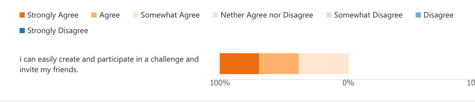
        
        
    

    <figcaption style="text-align:center;">Usability Test Results - Challenges</figcaption>
</figure>

**Overall Findings**

- Out of the 13 responses, 23.1% Strongly Agreed can create a Collection of photos and add another user photo to their collection. 23.1% Agreed and 38.5% Somewhat agreed 15.4% Neither agree nor Disagree.
- Out of the 13 responses, 15.4% Strongly Agreed that easily Create Portfolio. 30.8% Agreed and 46.2% Somewhat agreed 7.7% Neither agree nor Disagree.
- Out of the 13 responses, 23.1% Strongly Agreed can Report Bugs and inappropriate content easily, 38.5% Agreed and 23.1% Somewhat Agreed, 7.7% Somewhat disagree.
- Out of the 13 responses, 23.1 % Strongly Agreed that they can tag photos easily, 53.8% Agreed and 15.4% Somewhat agreed, 7.7% Neither agree nor Disagree.
- Out of the 13 responses, 30.8% can easily edit their details, 53.8% agree, and 15.4% Somewhat agree.
- Out of the 13 responses, 30.8% Strongly agree that they can quickly delete their accounts, 30.8% Agrees, and 23.1 somewhat Agrees, 7.7% Neither agree nor Disagree. 7.7% Somewhat disagree.
- Out of the 13 responses, 30.8% of the responses strongly agreed to create and participate in a challenge and invite their friends. 30.8 Agreed and 38.5 Somewhat agreed. 
- The consensus of all the subjects was that they found it relatively intuitive to participate and invite a friend to a challenge. 

- Subjects found the application intuitive and easy to use with high usability.
- Subjects found the application intuitive and easy to use with high usability.

The below figure shows the distribution of our Application's rating on a scale from 1-10 with 10. Our Application was highly intuitive with high usability and great interactivity with a straightforward and easy-to-understand layout, while a score of 1 means the exact opposite. 62% of the responses rated our Application in the range of scores from 7-10, which means the average score is 8.08.

<figure>
    

        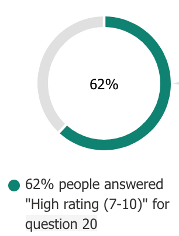
    

    <figcaption style="text-align:center;">Usability Test Results - Application High Rating</figcaption>
</figure>

**Qualitative Analysis** 

**The following are a few excerpts from the responses of the question “What did you like most about the app?”.**

“The Design”

“The ‘Playification’ feature of the app looks amazing”

“The Feedback forum was nice”

“Everything. All the features worked as expected. The ai caught even small human traces. 
 The navigation was really impressive. The bug reporting feature is a good touch. “

“Simplicity”

“The UI design and fluidity of animations, and the chat system”

“It's simple and clear”

“Color scheme is really good”

“User friendly”

“Adding GIFs to images and the challenges” 

“That google account can be used to create account easily”

“The leaderboard”

 

**The following are a few excerpts from the responses of the question “What did you like Least about the app?”.**

“The navigation in few pages were quite difficult.”

“It can be a little confusing initially to navigate.”

“Could use dark mode.”

“Dark mode should be available”

“Channel page and the portfolio page”

“The human image scanning takes a bit time and so does deleting the profile. But that’s not too bad.”

“Feed page”

“The chatting feature. I couldn’t really chat with anyone”

“The chat function was a bit confusing”

“The design.”

**The following are a few excerpts from the responses of the question “What Would you change in the app?".**

“Probably give a tutorial in the beginning regarding the main features of the app once a person signup for the first time.”

“The chats section”

“Nothing, just a native dark mode support and it's an amazing app”

“Overall, it’s a great app. I would probably change the likes implementation. Home page redirection (as a new user no content is shown), and possibly add dark mode.”

“The orientation automatically becomes landscape make it easier to add friends”

“Would add signup using email as well for those who don’t have a google account”

“The design”

In general, the participants liked some of the features and expressed that the user interface and layout were simple to use and the system itself was easily accessible and easy to understand for them. The changes suggested by the subjects correlate with the features they least liked on the application, the need for a “dark mode,” and making it easier for the users to be able to navigate to a post, making the Chatting system easier, adding more options to sign up beside the google account.

**Recommended Changes and Conclusions** 

- Add a dark mode feature. 
- make the navigation to different page easier 
- improve the human-AI Scanning Feature 
- Improve the chat system and make it easier.
- Add more options to log in or signup with, such as     "Email."
- CSS improvements
- Add instructions for first-time users.

Throughout the entire usability test, subjects highlighted some issues but generally had an enjoyable experience. They highlighted that the user interface was intuitive and easy to use, especially the introduction of our gaming system. 

The participants were able to complete the tasks with relative ease and grasped the application's ethos along with the concept of "playification."  

The issues highlighted mainly dealt with navigations in the app being hard and the chat page being confusing. Moreover, a dark mode feature should be added to make it a more enjoyable experience.

**Conclusion**

This section's aims and objectives were a proposed bid for the client, Dr. Richard Freedman, from OcTech Solutions to develop the photo-based social media platform known as Aperture. The section laid out a comprehensive description of each sub-section for the understanding of the client and the software development team.  

A firm conclusion we can draw from the usability study based off of the consensus of test participants is that the Aperture application is well received and has the potential to expand and scale up further.

The subjects we tested were very pleased with our Application and rated it high. The most liked features included the clear and simple UI, feedback forum, AI model that scans for humans in images, fluidity of animations, chat system, adding GIFs to images, challenges feature, account creation via google, game mechanics, and leaderboards.

