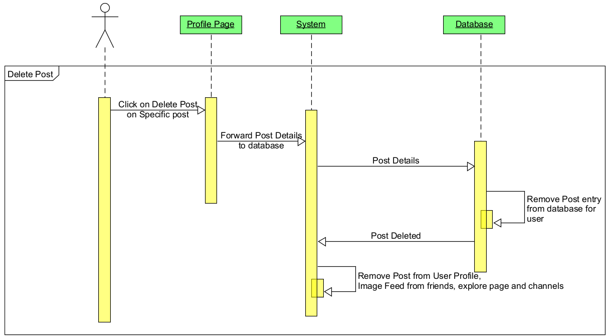
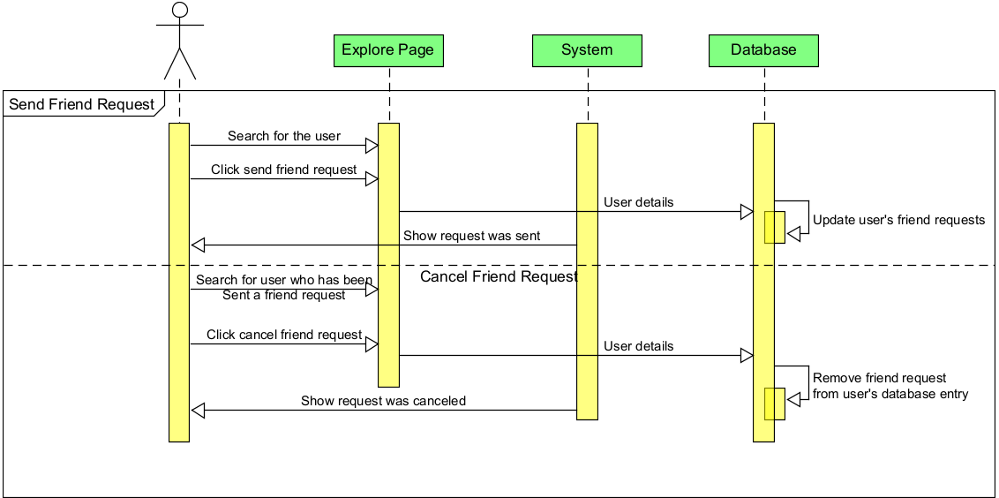
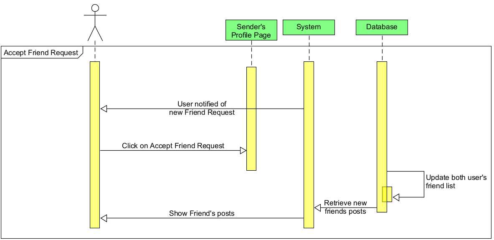
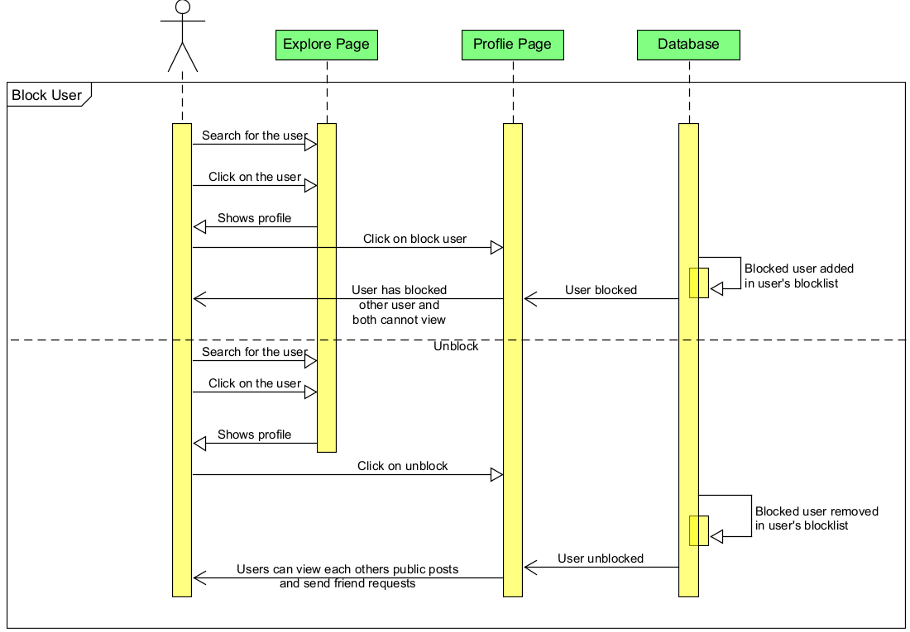
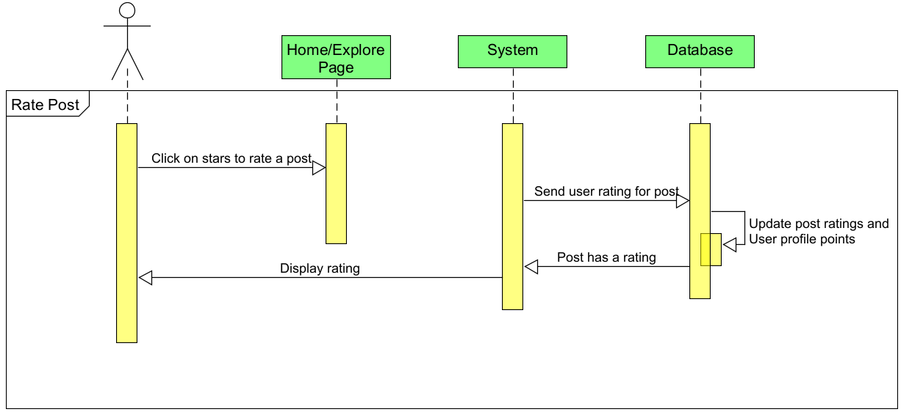
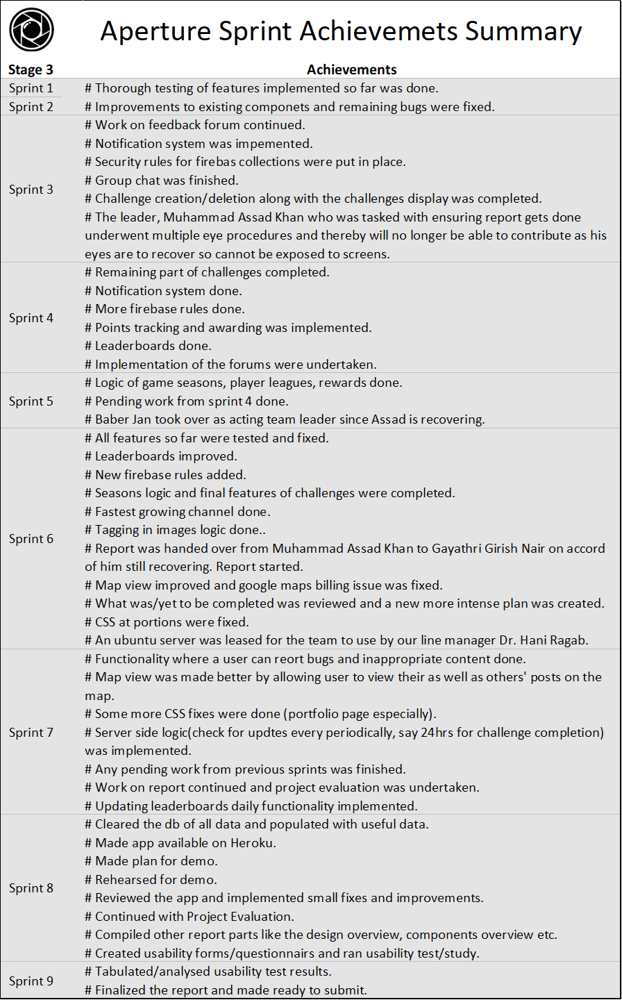
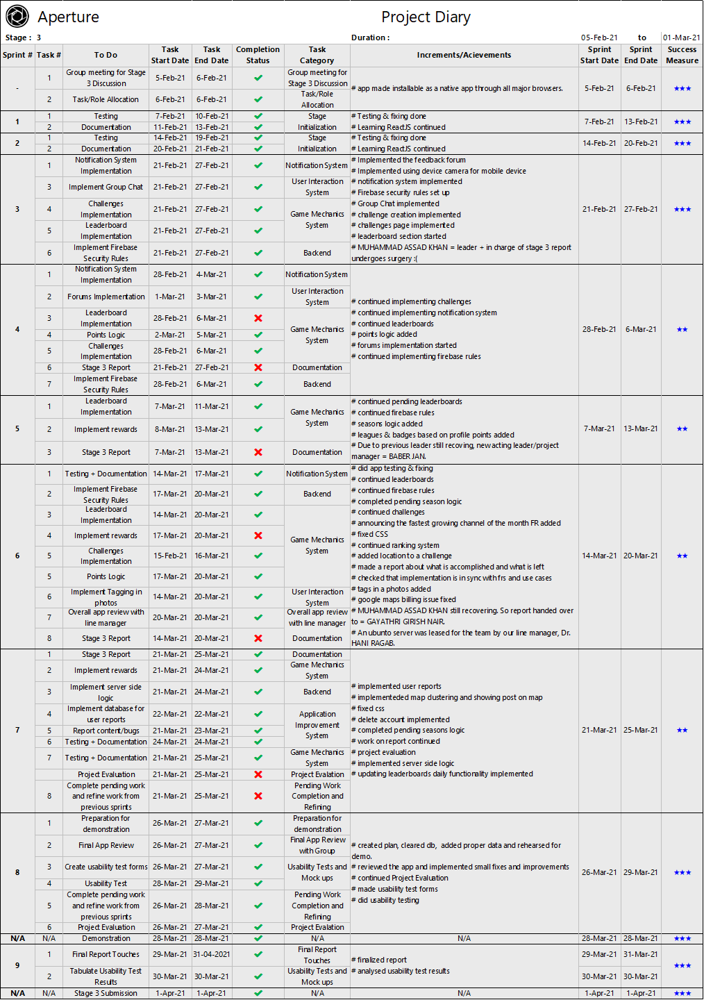
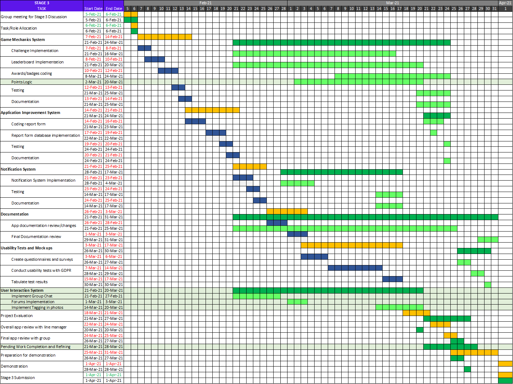

# Aperture By Octech Solutions

 

### Formal Team

**Line Manager**

​	Dr. Hani Ragab Hassen

**Team Lead**

​	Muhammad Assad Khan

**Acting Team Lead**

​	Baber Jan

**Members**

1. Baber Jan
2. Gaurav Gosain
3. Gayathri Girish Nair
4. Hasan Kapadia
5. Mohamed M Elfarash
6. Muhammad Assad Khan
7. Tasneem Hussein
8. Yoshi Jasmin

**Contents**

[TOC]

### The Vision

**Aperture** is a photo sharing application set in a fun, competitive and educational environment. 

By allowing users to create and enter photography challenges and gain points on their posts, aperture succeeds at giving users a unique gaming experience with players guaranteed a multitude of options to win challenges, badges and collect profile points.

Aperture allows users to share, comment and provide constructive feedback on posts in hopes of building an active, fun, encouraging and ever growing community of photography enthusiasts, hobbyists, professionals, gamers and anyone else who may be curious.

Every user's user experience, suggestions and privacy is important to us. Aperture enables users to report any content that they deem inappropriate or bugs that they discover to app managers. All application users shall follow a strict "no human in image" policy in adherence to our efforts at keeping this platform unbiased, focused on user contribution and free from legal hap hassle. 

****

### 1. Overview of the System (Gayathri)

*High-level overview of technologies and components.*

Aperture is a responsive, cross-browser compatible, web-based application developed primarily using ReactJS and supporting services.

##### 1.1. Technology Used

- HTML, CSS, JavaScript

- React JS, JSX
  - React DOM
  - React Bootstrap
  - React-HTML5-Camera-Photo API
  - React-Redux
  - Material-ui/core
    - Material-ui/icons 
    - Material-ui/lab 
  - Tenserflow-lite
      - tensorflow-models/coco-ssd
      - tensorflow/tfjs-backend-cpu
      - tensorflow/tfjs-backend-webgl
      - tensorflow/tfjs-converter
      - tensorflow/tfjs-core
  - Autosuggest-highlight
  - Avataaars
  - compress.js
  - filerobot-image-editor
  - framer-motion
  - moment
  - react-bootstrap
  - react-copy-to-clipboard
  - react-countdown
  - react-countup
  - react-cropper
  - react-datepicker
  - react-flip-move
  - react-giphy-searchbox
  - react-google-places-autocomplete
  - react-leaflet
  - react-map-gl
  - react-medium-image-zoom
  - react-router-dom
  - react-scripts
  - swiper
  - web-vitals
- Google Firestore 
- Firebase Authentication
- Firebase Storage
- Node Package Manager (NPM)
- Visual Studio Code
- Github
- Heroku CLI
- Ionic/Capacitor

- Visual Studio Code

- Github

  

##### 1.2. High level Components

1. **User Account System**

   This component handles user signup/login, profile creation/deletion/management and validation of user details. This component ensures that users submit consent forms in order to upload a photo of themselves as their profile picture or alternatively choose from pre-defined avatar pictures instead. 

2. **Content Creation System**

   This component focusses on enabling users to create/destroy content on the application. Users may create posts (comprising of images - via image upload/taken using camera, associated GPS data and text), channels, collections, challenges and a portfolio. Users may delete any content that they have created. Features supported include modification of images during upload, tagging of objects/public events in images and sharing of content (on feedback/gaming forums, profile, collections, channels, challenges and portfolio).

3. **User Interaction System**

   This component enables interaction among users and/or application managers. Facilitated features include a chat between users, rating of posts, point (profile/challenge points) tracking, adding/deletion of comments, sending/accepting/ignoring friend requests, blocking/unblocking of users, following/unfollowing of channels, a feedback forum, a gaming forum, search/explore facility, news feed fetching, leaderboard management, participation in challenges, notification handling, user content/bug/help reporting management and making recommendations.

4. **Game Mechanics System**

   This component handles the game aspect of the application and deals with allowing users to create and participate in challenges and earn points and badges via user ratings on profile and challenge posts. Display of point status summary on leaderboards, announcing of winners and providing rewards are also managed by this system.

5. **Notification System**

   This system ensures that users are aware of all major events that they may be interested/involved in by sending notifications if and when they occur. Notifications will be sent when a user sends a friend request, likes a post, leaves a comment, accepts a friend request and deletes a challenge to name a few events.

6. **Application Improvement System**

   This component is the means through which users can contribute to improving the app by reporting bugs or inappropriate content. This system ensures that all user reports will be displayed to application managers so that they may monitor user satisfaction and take necessary action to ensure that the app remains safe and fun for all.

****

### 2. Detailed Design (Elfarash, Hasan, Assad, Gaurav(Class Diagram))

*Dataflow diagrams, UML diagrams, Class diagrams, etc.*

This section features visual aids that clarify/support design choices made. Significant diagrams that were described in detail in stages 1 and 2 of this project shall be revisited here in addition to new ones.

**After Stage 3, all 6 sub-systems are completed.** The 1st 3 sub-systems with use case diagrams depicting them along with supporting sequence diagrams have been provided and explained in details in stage 2 report. Use case diagrams related to systems 4, 5 and 6 have also been presented in the stage 1 report. These diagrams shall be revisited here. New sequence diagrams in support of systems 4, 5 and 6 will can be found below.

###### 1. User Account System

<figure>
    

        
    

    <figcaption style="text-align:center;">
        Use Case Diagram - User Account System
    </figcaption>
</figure>

<figure>
    

        
    

    <figcaption style="text-align:center;">
        Sequence Diagram - Create Account
    </figcaption> 
</figure>

<figure>
    

        
    

    <figcaption style="text-align:center;">
        Sequence Diagram - Login
    </figcaption>
</figure>

<figure>
    

        
    

    <figcaption style="text-align:center;">
        Sequence Diagram - Logout
    </figcaption>
</figure>

<figure>
    

        
    

    <figcaption style="text-align:center;">
        Sequence Diagram - Reset Password
    </figcaption>
</figure>

###### 2. Content Creation System

<figure>
    

        
    

    <figcaption style="text-align:center;">
        Use Case Diagram - Content Creation System
    </figcaption>
</figure>

<figure>
    

        
    

    <figcaption style="text-align:center;">
        Sequence Diagram - Reset Password
    </figcaption>
</figure>

<figure>
    

        
    

    <figcaption style="text-align:center;">
        Sequence Diagram - CreateCollection
    </figcaption>
</figure>

<figure>
    

        
    

    <figcaption style="text-align:center;">
        Sequence Diagram - Create Portfolio
    </figcaption>
</figure>

<figure>
    

        
    

    <figcaption style="text-align:center;">
        Sequence Diagram - Delete Channel
    </figcaption>
</figure>

<figure>
    

        
    

    <figcaption style="text-align:center;">
        Sequence Diagram - Delete Collection
    </figcaption>
</figure>

<figure>
    

        
    

    <figcaption style="text-align:center;">
        Sequence Diagram - Delete Portfolio
    </figcaption>
</figure>

<figure>
    

        
    

    <figcaption style="text-align:center;">
        Sequence Diagram - Delete Post
    </figcaption>
</figure>

<figure>
    

        
    

    <figcaption style="text-align:center;">
        Sequence Diagram - Share Content
    </figcaption>
</figure>

###### 3. User Interaction System

<figure>
    

        
    

    <figcaption style="text-align:center;">
        Use Case Diagram - User Interaction System
    </figcaption>
</figure>

<figure>
    

        
    

    <figcaption style="text-align:center;">
        Sequence Diagram - Send Friend Request
    </figcaption>
</figure>

<figure>
    

        
    

    <figcaption style="text-align:center;">
        Sequence Diagram - Accept Friend Request
    </figcaption>
</figure>

<figure>
    

        
    

    <figcaption style="text-align:center;">
        Sequence Diagram - Add Comment
    </figcaption>
</figure>

<figure>
    

        
    

    <figcaption style="text-align:center;">
        Sequence Diagram - Block User
    </figcaption>
</figure>

<figure>
    

        
    

    <figcaption style="text-align:center;">
        Sequence Diagram - Chat
    </figcaption>
</figure>

<figure>
    

        
    

    <figcaption style="text-align:center;">
        Sequence Diagram - Follow Channel
    </figcaption>
</figure>

<figure>
    

        
    

    <figcaption style="text-align:center;">
        Sequence Diagram - Rate Post
    </figcaption>
</figure>

<figure>
    

        
    

    <figcaption style="text-align:center;">
        Sequence Diagram - Share Content
    </figcaption>
</figure>

<figure>
    

        
    

    <figcaption style="text-align:center;">
        Sequence Diagram - Image Feed
    </figcaption>
</figure>

<figure>
    

        
    

    <figcaption style="text-align:center;">
        Sequence Diagram - View Photo Map
    </figcaption>
</figure>

###### 4. Game Mechanics System

<figure>
    

        
    

    <figcaption style="text-align:center;">
        Use Case Diagram - Game Mechanics System
    </figcaption>
</figure>

###### 5. Notification System

<figure>
    

        
    

    <figcaption style="text-align:center;">
        Use Case Diagram - Notification System
    </figcaption>
</figure>

###### 6. Application Improvement System

<figure>
    

        
    

    <figcaption style="text-align:center;">
        Use Case Diagram - Application Improvement System
    </figcaption>
</figure>

*MORE ...*

****

### 3. Final Interface Design

This section in addition to design elements and thoughts behind the final product, captures approaches that were taken and milestones reached along the way. Also included is a brief description of testing methods adopted to ensure technical correctness and a short guide to application installation, setup, maintenance and usage.

##### 3.1. Application Layout & Navigation (Elfarash, Yoshi)

*Layout and navigation of the application or applications.*

*MORE ...*

##### 3.2. Implementation Methodology (Gayathri)

*Iterations/Scrum/Other agile techniques?*

For implementation and Project Management, it was decided that **Agile** would be the best approach for the following reasons...

- It allows for incremental development. A large application with many user interactions like Aperture would be best tackled by breaking it down into smaller components and then implementing each part one at a time, building up the complete application.
- It's iterative in nature. Iterations are an excellent way to schedule work as they establish a common system following which and a set time interval within which a functionality is to be implemented. 
- It grants adaptability. Agile allows components to be revisited and fixed or improved at later iterations. This means that if a system was not fully implemented in one iteration, the team need not be discouraged as they may have an opportunity to revisit unimplemented parts of it and finish them in the later iterations.
- Agile means that after every iteration, it is highly likely that a part of the application would be implemented, tested and available for review. This instills a sense of accomplishment in team members and product reviewer alike.

There are several agile frameworks out there like the Feature Driven Development, Lean Software Development etc. But, **Scrum** was chosen as best for this product due to following reasons ...

- It encourages good communication among members and requires great transparency within the group. As a team were majority of the members have no worked with each other before, scrum would ensure that all members are aware of all progress/disruptions and would aid in building an environment of trust.
- Presence of a scrum master to ensure that scrum is followed is a necessary force that can help ensure that every member contributes, are reminded to focus on the task at hand and are never lost as a result of scrum getting implemented well.
- Daily scrum reports are a great way to ensure that work is done regularly and wakes a sense of duty/responsibility in every member.
- Scrum has been proven to bring teams together towards a common goal. It is also very popular in the industry as is evident from large and successful tech companies like Google, Apple, Adobe etc, opting for this approach. As students who hope to enter the industry, it exciting to explore an implementation approach that is implemented by the titans of the tech world!

**The following is a diagram that depicts a sprint's structure.**

<figure>
    

        
    

    <figcaption style="text-align:center;">Sprint Structure</figcaption>
</figure>

**Note:** Above image "Sprint Structure" is from a sprint cheat sheet that can be obtained from the description of YouTube Video, ["Scrum Overview - [Scrum Basics 2019] + FREE Cheat Sheet" by "Development That Pays".](https://www.youtube.com/watch?v=RCJghFbXSPk&list=PLngnoZX8cAn9dlulsZMtqNh-5a1lGGkLS&index=1)

**This is how our sprints went ...**

- The implementation schedule took place in **sprints** where a single sprint would typically span **a week**. It was decided that a sprint would be short and just 1 week since that would allow for more opportunities to retrospect and identify what went right/wrong and what to fix. A stage of development was expected to be complete in 8-9 sprints which was indeed the case for all 3 stages of design & development. For the few sprints that were shorter than a week, some activities like building code was done in parallel to testing and producing documentation.
- Every sprint would begin with the **sprint planning meeting** on MS Teams / on rare occasions via chat and deciding what to put in our sprint backlog from our product backlog for the next week and what to focus on more.  product backlog was based off of the functional requirements that we had compiled features that the client absolutely required were marked as MUST and would be at the top of the product backlog and then other less important features would be in the middle and the bottom. Any functionality that was partially or done as a basic version would be in lowered in priority. 
- Based off of discussions, that night or latest by next morning which would be the 1st day of sprint. The scrum master would officially list down allocated tasks in the Scrum WhatsApp Group. The team would post **daily scrum reports** every morning with updates.
- At the end of each sprint we would have produced at least 1 or 2 **increments** in addition to few partially implemented functionalities or maybe 1 that was implemented but did'nt work out too well. These would be rescheduled for later.
- By now, it would be time for the weekly meeting with our line manager and all happenings of the scrum, future plans and increments would be presented. Often Dr. Hani Ragab, would give us good feedback and let us know what could improve. This meeting along with discussions that the team would have later after our line manager left would be a **scrum review**.  
- Later that evening the team would decide what to carry forward into the next sprint and how it could be done in a better way than in last sprint in a **sprint retrospection** session. 

This process **repeats** with an MS Teams sprint planning meeting again.

##### 3.3. Iteration Achievement History (Gayathri)

*What was achieved in each iteration/sprint?*

Following are 3 tables that summarize all achievements from every sprint for stages 1, 2 and 3 respectively.

<figure>
	
    <figcaption style="text-align:center;">Achievements Summary Stage1</figcaption>
</figure>

<figure>
	
    <figcaption style="text-align:center;">Achievements Summary Stage2</figcaption>
</figure>
<figure>
	
    <figcaption style="text-align:center;">Achievements Summary Stage3</figcaption>
</figure>

##### 3.4. Testing Regimen (Yoshi)

*How was the final system tested for technical correctness?*

During the development of the application’s functionality throughout stages 2 and 3, every functionality was tested each time a new functionality was added into the application. Using firebase console, it would be possible to see the collections and documents in the database and check if the data entered was correctly stored and later, correctly retrieved from firebase as JSON objects.

 

<figure>
	

        
    

    <figcaption style="text-align:center;">
        Continuous Integration and Continuous Delivery
    </figcaption>
</figure>

The testing method adopted is of **Continuous Integration & Continuous Delivery** (CI/CD) as per which, features are released by periodically integrating code changes into the main software branch, testing them as early and as frequently as possible, and incorporating feedback/fixing bugs and relaunching them. This continuous cycle of automating the product delivery pipeline ensures that features are made available to users quickly, efficiently, and sustainably. CI/CD makes for an un-compromising practice in the Agile software development and project management lifecycle.

Testing was also done across a variety of web browsers, in particular Google Chrome, Edge, Brave and Safari. The app was tested thoroughly at every point of development, for example login and sign-up functionality were very important features of the User Account System which had to be tested for accuracy and technical correctness concerning the new user entries made along with user details verification and user account verification. The firebase database was frequently checked after every new user entry was made to ensure that the data stored was accurate and each user was correctly verified before logging in, and they completed their one-time email verification before they could login for the first time. 

Usability tests conducted via questionnaires ensured that different users tested our app and gave feedback. These opinions and feedback from stage was used to determine possible improvements and identify issues, that would be corrected for the final version.

##### 3.5. Install - Setup - Maintain (Baber)

*Documentation on how to install/setup/maintain the final system.*

###### 3.5.1. Installation

Our application is developed using React . So the client needs to have a JavaScript environment and a Package Manager so that we can download and install libraries including React.

**To install and build our application Aperture the client should follow these steps:**

- Download and install     Node.js. The client can download Node.js from its official website : https://nodejs.org/en/ and follow the given instructions on how to install Node.js on their device.

- Use Node Package Manager to download and install required packages for the app. This is to     be done by :

  Running ***npm install --legacy-peer-deps*** command inside the     project’s ***/octech*** folder . 

- Use Node Package Manager to deploy our app Aperture. This is to be done by :

  Running ***npm run build*** command inside the project’s ***/octech*** folder. This will create a build directory with an optimized     production build of our app.

- Upload the ***build*** folder to the client’s HTTP sever.

- Serve the incoming user requests with ***index.html*** file inside the build folder.

  

###### 3.5.2. Set Up

**The client will have to set up:**

1. <u>**Firebase**</u>
   - Create a firebase account on https://firebase.google.com/
   - Create a firebase project and register our app by following Step 1 and Step 2 from [https://firebase.google.com/docs/web/setup#node.js-apps](https://firebase.google.com/docs/web/setup#node.js-apps)
   - Go to ***Authentication*** from ***Firebase console.***  
   - Open ***Sign-in Method*** tab and enable ***Email/Password*** and ***Google*** providers.
   - Go to ***Project Settings*** from the ***Firebase console***.
   - In the Your apps card, select the nickname of our app.
   - Select ***Config*** from the ***Firebase SDK*** snippet pane.
   - Copy the config object snippet and replace it with value of variable 
      ***firebaseConfig*** in ***/octech/src/firebase.js*** file in our project directory ***Aperture***.
   - Open ***Cloud Firestore*** from ***Firebase console.**
   - Go to ***Indexes*** *tab and create following **indexes** for the following* **Collections:**

<figure>
	

        
    

    <figcaption style="text-align:center;">
        Cloud Firestore Collections Indexes
    </figcaption>
</figure>

2. <u>**Google Map API**</u>

   - Sign In to the Google Cloud Platform Console on https://console.cloud.google.com.
   - Create a new project and enable the Google Maps JavaScript API for the project.
   - Copy the API key and paste it as the value of ***GoogleMapsAPI*** constant in ***/octech/src/components/Body/Map/client-config.js*** file.

3. **<u>GIPHY API</u>**

   - Create a developer account on GIPHY at https://developers.giphy.com/docs/api.
   - Create an API key for our app by clicking “Create an App” on the developer dashboard.
   - Copy the API key and paste paste it as the value of ***GiphyApiKey*** constant in ***/octech/src/components/Body/Feed/giphy-config.js*** file.
   - Upgrade the API to production level by clicking on ***Upgrade to Production*** button in the ***Developer Dashboard*** and complete the instruction that follow.

4. **<u>Time Based Job Scheduler</u>**

   - Setup a time based task scheduler on their server. The application will be different for different operating system e.g linux uses cron to schedule tasks.

   - Open ***Settings*** in ***Firebase console*** of your account. Then open ***Service Accounts.***

   - To generate a private key for you service account click on ***Generate New Private Key*** and then confirm by clicking ***Generate Key*** button.

   - It will ask you to download the JSON file containing the key. Securely store this JSON file.

   - Set the path of the JSON file as the ***argument*** to ***credentials.Certificate*** method in /timeBaseTasks/daily.py*** and ***/timeBaseTasks/monthly.py*****

   - Setup daily task to run Python script ***/timeBaseTasks/daily.py***.

   - Setup monthly task to run Python script ***/timeBaseTasks/monthly.py***.

     

###### 3.5.3. Maintenance

We have developed the app such that the maintenance of the app will be effortless.

Throughout the development we have followed React’s file structure and naming conventions. So, to add a feature or fix a bug on the feed page we will go to the ***feed.js*** inside the ***/Feed*** folder of our app and do the required changes. All our code is well commented which makes the understanding of the code unchallenging.
 For general maintenance the client must do the following tasks :

- Check the ***bugReports***  collection of db. This contains information about the bugs or information of posts reported by the users. These bug reports should be analyzed and necessary actions should be taken.
- Use ***Firbase Analytics*** to track the engagement of the users with the app. This can be accessed by from ***Firebase console.***
- Use ***Firbase Crashlytics*** to prioritize and fix stability issues. This can be accessed by from ***Firebase console.*** 
- Use ***Firebase Overview*** to get insights on current read and writes to our database. This can be accessed by from ***Firebase console.***
- Create weekly global exciting challenges. 

***Octech Solutions* will be providing 3 maintenance packages to the client which include:**

1. <u>Base package</u> (1-year limited support): We will provide the first year of support for the product after its deployment for free. This will include providing security updates for the product. As well as providing patches for any bugs or instabilities that may arise.
2. <u>Extended package</u> (2-year support): Will provide the same level of support as the base package but, for two years. Will also work on a number of features that users or the client may want added to the product. 50 hours will be allocated throughout the 2 years (not including support and maintenance)     for adding extra features.
3. <u>Deluxe package</u> (3-year support): Similar to the extended package but, this time for 3 years. And 120 hours will be allocated for adding features to the product throughout the three years (not including support and maintenance).

Other details of these packages such as costing have been already given to client in the Project Costing section of the proposal document for our application “***Aperture***”.

##### 3.6. User Guide (Baber)

*Short user guide.*

*MORE ...*

****

### 4. Project Evaluation

*Assess project as a whole.*  

This section, after an overall analysis of the the production process and final product, lays out organizational approaches taken, the development journey and value of the final product (includes descriptions of functionality achieved, limitations, unique elements and usability test results). 

##### 4.1. Organization (Gayathri)

###### 4.1.1. Organizational Structure

*How was your group organized?*

The group was organized such that every member would contribute to all parts of design and development. 

Some possible languages/technical skills which would potentially be needed in the project was identified and members were required to grade themselves and assign points reflecting their confidence levels in these areas. This was a good exercise in ascertaining capabilities of team members that would prove crucial in assigning team roles.

<figure>
	
    <figcaption style="text-align:center;">Confidence Points</figcaption>
</figure>

In order to ensure optimum deployment of team members, a **SWOT analysis** was carried out.

<figure>
    

        
    

    <figcaption style="text-align:center;">SWOT Analysis Square</figcaption>
</figure>

Based on observations and after discussion, following roles were initially decided upon. However, it was decided that all members would contribute to all areas of developments. The allocated roles would mean that every member would oversee/guide activities that would fall under his/her role description.

- Baber Jan - Back-End Lead Developer & **Scrum Master**
- Gaurav Gosain - Front-End Lead Developer
- Gayathri Girish Nair - Programmer & Designer
- Hasan Kapadia - **Team Leader** & Database Lead Developer
- Mohamed M Elfarash - Programmer & Documentation In Charge
- Muhammad Assad Khan - Programmer & Report In Charge
- Tasneem Hussein - Graphic Design Lead & Programmer
- Yoshi Jasmin - Application Testing In Charge & Programmer

Towards the end of stage1, it was a collective decision to appoint Muhammad Assad Khan as the new leader as the previous leader was unable to fully commit to oversee the team due to personal issues. Later during stage 3, Baber Jan who is our scrum master, was appointed as the project manager/acting team lead since Assad was unable to contribute on account of having to stick to a recovery regimen following medical eye procedures. As we worked together, each members' true strengths surfaced and it became clearer where each member's primary capabilities were. 

Following is a categorization of members as per their primary aptitude adhering to **Honey’s 5 Team Member Types**. 

<figure>
	
    <figcaption style="text-align:center;">Honey's 5 Team Member Types</figcaption>
</figure>

- **Leader**: Ensures clear objectives, collective involvement and commitment.
- **Challenger**: Questions effectiveness, presses for improvement and results.
- **Doer**: Is practical, reminds team to keep moving and thereby drives team forward.
- **Thinker**: Produces carefully considered ideas and critically reflects upon other ideas/achievements.
- **Supporter:** Maintains team harmony and helps carry out/complete tasks.

That said, it was observed that collective efforts undertaken by the team led to all members qualifying to befit many of the above categories at various stages of design, development and documentation.

###### 4.1.2. Team Work 

*Was the group organization successful? How well did your group collaborate?* 

Throughout development, all members were willing to collaborate and have always tried to produce good work. Even though members were allocated primary roles(see section 4.1.1), the group shared responsibility fairly equally. Challenging situations like when the leader was re-appointed and when the leader got sick was thus, less damaging and the team was still able to produce good work during these situations. 

Having members who had fine tuned programming skills as well as those who were proficient at organizing work, making plans, producing documentation, creating diagrams, critical analysis, coming up with designs and presenting content meant that the team was well balanced. This mix of skills allowed for members to compliment each other well.

A team member skilled at a particular task would guide others and draft a plan as to how to approach that task and all members would collaborate and contribute their portions to aid in completion of that task. A notable example of this system in action is the report generation process. One member who was skilled at organizing content, visualizing data and presenting information would be appointed to draft and oversee the report. This member would begin work on the report early on, decide what to put in it and appoint other members to contribute some parts of the report. Every member would submit their parts to the  report in-charge and this person would go on and compile the report, ensure uniformity and get it ready to submit. Since scrum was already used by the team in software implementation, it was decided that we would use scrum to produce documents, plans and the report by identifying their parts and dividing the work and monitoring our daily progress along the way in short sprints.

In all instances where one member had tried to implement a feature but failed/if that needed improvement, either another member would go ahead and complete that task or would act as a guide helping complete it. For example, the functionality of creating/deleting/sharing collections was implemented in stage 2 by a member. Whist functionality was achieved, it was a raw version with very basic CSS and styling. This was later in stage 3, improved by another member to adhere to the theme of the application. Also, by stage 3, the team had gained more experience and a member had implemented a new layout for image upload. Since this was superior to what was already in place, the team decided that this member would go ahead and replace the current mechanism in the app with this better one thus improving the overall quality of the application. 

###### 4.1.3. Overcoming Problems

*How did you handle any problems which arose?*

Following are few problems that the team had faced and methods that were adopted to combat them.

1. **Lack of Communication**

   <u>Problem</u>

   Since we intended on following the scrum framework that implements the agile approach of project management, it was required that 4 key meetings or in the situation of the COVID-19 pandemic, online meetings were to be held consistently to review work, share updates and make plans. It was observed early on that all members were unable to make it to these meetings on Microsoft Teams due to various issues (network related/health related/academic pressure). Although the team took efforts at having at least 1 meeting per sprint, 4 meetings (sprint planning meeting, daily scrum meeting, review meeting and retrospection meeting) was not taking place. After the 1st 2 sprints of stage 1, this issue was evident. It was recognized that since academic pressure would only increase as the semester progressed and that later stages (stage 2 and 3) being software implementation heavy, demanded following scrum with good, regular communication in order to successfully produce a working application. Thus, something had to be done.

   <u>Solution</u>

   Regular meeting are a key part of the scrum framework. It ensures that members are aware of the progress made, what to and by when to do it at all moments in development. It was decided that since the reasons for not being able to commit to meeting via MS Teams 4 times a sprint and daily for the daily scrum were legitimate an alternative approach to discuss needed topics, one that was sustainable and reliable in the long run had to be set.

   The team decided to create 2 specialized work only WhatsApp groups that would be a means of information exchange every day. The 1st group was a "Discussion" group where members were allowed to discuss any ideas / implementation techniques / problems faced with a tasks / possible solutions to problems with each other. The second group was called the "Daily Scrum" group were every member would report their daily scrum reports (what was achieved yesterday, what will be achieved today) every morning and the scrum master after having discussed with the group in previous MS Teams meeting as well as in the Discussion group, will assign tasks to each member at the beginning of a new sprint. The WhatsApp groups had the added advantage that chats could be exported and viewed to review discussions or decisions that were previously taken.

   Also, the team at this point decided to take 2-3 days time to learn to use GitHub well and push all work to our GitHub repository regularly.

2. **Unable to Find Files**

   <u>Problem</u>

   All stages of development involved production of various files (documents, images, excel sheets etc.). These files were shared via the WhatsApp discussion group and thus would get lost amongst conversation. This meant that files shared in the past were hard to find among conversations.

   <u>Solution</u>

   This problem was addressed though the simple yet effective decision to create one more WhatsApp group for the sole purpose of sharing files only. Web WhatsApp allowed file to be uploaded from and downloaded to our laptops/PCs with ease. Also, for parts of development that required a lot of common files like code/the report, it was decided that these files may also be stored on GitHub repositories where members can easily access and update them.

3. **Too much of a good thing, a bad thing?**

   <u>Problem</u>

   Because every decision was discussed and because every member always had inputs and wanted the best, there were often a lot of different approaches to solving a particular problem and clash of ideas/opinions was frequent. There was a tendency to overthink and get stuck thinking about details which would lead to decision paralysis and one idea could not be chosen over another as both would be possible ways to implement a feature.

   <u>Solution</u>

   Such problems became less prevalent as the team continued to work together. Soon there was more trust amongst members and one member simply trusted the other to implement the best possible solution to a problem. An understanding was reached where in it was decided that every member would try and implement their appointed feature within the sprint upholding minimum standards. If the member managed to finish the feature before the sprint ended then he/she would spend time improving it. Else, that member was to move on to the next task until there came an opportunity when this feature could be improved either by the same person who first implemented it or by someone else in a later sprint. Decision dilemmas would also be solved via voting or asking for the line manager's view.
   
4. **ReactJS Learning Curve**

   <u>Problem</u>

   ReactJS is a powerful tool as it allows for the creation of reusable components and implement complex html, javascript, css interation via JSX. But Learning it proved very difficult as concepts of states, life cycle functions, hooks etc in ReactJS in conjunction with google firebase services was hard to understand and grasp at enough depth to be able to achieve a functionality.

   <u>Solution</u>

   It was decided that trying to implement a feature with little knowledge would inevitably result in mistakes that would ultimately be costly. So, it was decided that it would be better in the long run for members to take up-to a week or two to learn React and how it works before implementing core functionalities/complex functionalities. This meant that some time would be lost and the pre-planned initial schedule for implementation designed in scrum 1 would not be able to be strictly followed. But the agile approach meant that later sprints could be tweaked to account for this necessity and hence the team proceeded to implement the simplest features / features using concepts grasped first before tackling more complex systems.

5. **Need to Update Database after Regular Intervals.**

   <u>Problem</u>

   For some parts of the app like challenges, there was a need to check after regular intervals say 24 hours, if whether a challenge was still open or not. In such scenarios an action such as loading of the challenges was what was used to trigger the checking. This is not the best was since if a challenge closed after 24 hours while a user was viewing already loaded challenges, then this change would not show up.

   <u>Solution</u>

   To combat this issue as well as to implement all other periodic testing like checking for user content / bug report regularly, an ubuntu server was leased and programmed to regularly do this.

*GIVE MORE DETAIL IN SERVER PART ...*

###### 4.1.4. Sticking To Schedule 

*How successful were the timings in your original plan?*

The initial schedule drafted in Stage 1 was based off of speculated dates and approximations as to when we would have our demo, how long it would take to learn ReactJS, how successful we would be at implementing a particular core system within the application would be. These dates were not expected to be hit precisely as it was expected that not every iteration would result in a functional increment. Thus, there was quite a bit of deviation from the original plan as if a sprint resulted in partially implemented features then those would be pushed to next sprints and this would deviate from the original plan even more. 

<figure>
	
    <figcaption style="text-align:center;">
        Pre Planned Vs Implementation Schedule Observations Table
    </figcaption>
</figure>

From above table, it can be observed that the in stage 1, implementation of every Main Task saw an average deviation of 8 days per task, stage 2 of 6 days and stage 3 of 17 days. Note that this deviation takes into account both instances where in a task was started ahead of schedule, where one was stretched behind schedule and where one finished earlier. 

With this in mind, stage 1 was the most successful as it only had 1 main task that was completed behind schedule with a 12 day deviation and the other 2 tasks behind scheduled had a deviation of 6/only 1 day. 

Stages 2 and 3 however saw more deviation. This was expected as these stages involved more code implementation and few functionalities in almost every sprint would only be partially achieved or achieved at a very basic level needed improvement later. This would cause more deviation as dates for these tasks had to be reallocated.

The fact that the team had to take some time at the beginning of stage 3 to understand some more advanced ReactJS concepts like async functions, higher order components etc and some basic features that weren't yet fully understood better, led to the major deviation from the original plan. Moreover, our leader being unable to contribute due to medical eye procedures and thus a prescribed curb of screen time also led to few deviations.

The choice to adopt scrum and extra efforts by all members in stage 3 is what led to successful implementation of the application. All core functionalities that had remained was eventually implemented in iterations via revised implementation plans made after every sprint. 

This journey can be observed in detail in the 4.2.1 (Implementation Schedule) section of this report.

From this experience the team has reflected that the initial plan made in stage 1 had underestimated the learning curve that members had with respect to ReactJS and didn't have much wiggle room. Also, from above table it can be seen that 3 main tasks were added that were not accounted for in the initial plan. 

Opportunities for learning and completion that agile provided and the team's commitment to it made it possible to complete all planned tasks. In stage 3, it was observed that after the team took the time to learn and practice react, that in combination to the fact that the team was by now used to the scrum framework let to members being more productive. This boost in performance achieved though learning and cooperation is what led to a final finished product.

##### 4.2. Implementation

###### 4.2.1. Implementation Schedule (Gayathri)

*What was your implementation schedule? How did the implementation schedule differ from the original plan?*

The implementation schedule drawn from the "**Aperture Project Diary**" can be viewed below in 3 tables. One for stage1, stage2 and stage3 respectively. The "Success Measure" column ranging from 1 to 3 stars depict how successful/effective at getting work done, each sprint was.

<figure>
	
    <figcaption style="text-align:center">Project Diary Stage 1</figcaption>
</figure>

<figure>
	
    <figcaption style="text-align:center;">Project Diary Stage 2</figcaption>
</figure>

<figure>
	
    <figcaption style="text-align:center;">Project Diary Stage 3</figcaption>
</figure>
It can be observed that stage 1 was successful for the most part with all functionalities tasks completed. Then stage 2 was less successful than stage 1 since there were more tasks that had to be rescheduled as can be seen from sprints 4 and 5. Also gaming and feedback forums could not be fully functional at the end of the stage. They were functional but were very basic versions with just basic functionality and no CSS styling at the end of stage 2. This did not meet the definition of "done" as this late stage in sprint 7 since only one sprint was left. Thus these 2 forums were with held from officially becoming part of the submitted version for stage 2 and became integrated into the application after being fully functioning at stage 3.

**Below are the charts with the plan for each stage made in stage 1. The dates from actual implementation schedule was added to this in order to view a comparison.**

<u>Notes to consider when reading the charts</u>

- The days marked in orange and blue are from the original plan with the orange dates corresponding to main tasks and blue ones to sub tasks.
- Similarly, all green/red colored squares stand for days from the actual implementation schedule that followed agile. Dark green squares correspond to main tasks and light green ones to sub tasks that were successfully implemented. Red squares show tasks that could not be implemented (the forums in stage 2).
- The rows colored a pale green are tasks that were added in the implementation plan and didn't exist in the original plan.
- The dates in green are dates from the original plan that was exactly hit by the dates from the implementation plan. and the red date are those that were not.

<figure>
	
    <figcaption style="text-align:center;">Implementation Comparison Chart Stage 1</figcaption>
</figure>

<figure>
	
    <figcaption style="text-align:center;">Implementation Comparison Chart Stage 2</figcaption>
</figure>

<figure>
	
    <figcaption style="text-align:center;">Implementation Comparison Chart Stage 3</figcaption>
</figure>

The above comparison chart data was used to extract the Pre Planned Vs Implementation Schedule Observations Table from section 4.1.4 (Sticking to Schedule).

###### 4.2.2. Path to Success (Gayathri)

*provide examples*

*Was your implementation approach successful (scrum, other, etc)? Why or why not? Use specific examples from your experiences to support your discussion.* 

<u>Pros</u>

- Initially the team was very lost and awestruck at the massive task that lay ahead. This is when the decision to sit down and **identify systems** that would make up our application proved helpful. Initially 11 systems where identified which was then narrowed down to 6 ...

  1. User Account System
  2. Content Creation System
  3. User Interaction System
  4. Game Mechanics System
  5. Notification System
  6. Application Improvement System

  This breakdown of the application allowed the team to develop a wholesome view of what the application would look like and what it would be capable of. We then went on to tackle one system at a time, always beginning by identifying main tasks and implementing them.

- The **flexibility** that **scrum** provides allowed us to implement parts of the app that felt manageable at a given moment knowing that once the team had amassed further knowledge regarding a topic, those very basic versions first implemented in a previous scrum may be revisited, tweaked and refined in a later scrum.

- Having a **scrum master** that regularly discussed with the group and updated with allocated tasks on a weekly basis allowed for the team to always have **an idea about the next most important tasks.** At instances where the team was faced with an especially challenging system like the user interaction system with multiple components like creation/deletion of posts, collections etc, the fact that in an iteration one had to only address a small part of it led to the team being able to divide and conquer it.

- **Daily scrums**, **Scrum Reviews** and **Retrospection** were a constant reminder of just how much had been and were yet to be achieved every week. Any sprint tasks not achieved this week would be reallocated next week in addition to other tasks. This succeeded at keeping the team on toes and though at variable rates, **weekly sprints ensured that weekly progress was made**.

- Every sprint would culminate in all members reviewing and testing out functions implemented thus far before suggesting fixes/improvements that would be implemented in the next sprint if deemed necessary. These **implement > test > fix > implement next** iterations ensured that the team **produced working parts** of the application almost **every week** and it would be **unlikely** that these parts **would need to be changed later** on. This approach also meant that we would have a new working feature to show our line manager at nearly every meeting. 

- Opting **React JS** enabled the team to create **components** that could be **reused** and take advantage of **vast libraries and frameworks** that React supports like Material UI, React Bootstrap etc. Due to React being a popular choice amongst application developers, **finding** online **tutorials** and **reading material** on it **was not difficult**. 

<u>Cons</u>

- Opting **ReactJS** meant that most of the team had to take the **time to learn** its key features. This resulted in some time in our development journey (Scrums 1 & 2 of stage 3) getting dedicated to learning it. Also, lack of sufficient knowledge of how to achieve a particular task had resulted in slower progress than ideal at several points in Stages 2 and 3 corresponding to implementing complex systems like the user interaction system, game mechanics system and chat feature.

- The constant pressure to produce **daily scrum reports** was **at times overwhelming**.

- The team was always very active and driven to produce a great product. Every member had **lots of ideas/opinions** to make the application better. Whilst this meant no shortage of options, it also meant that it took **longer to reach a consensus** and would also lead to **disagreements** that had to be resolved from time to time. This scenario was especially prevalent during the **initial stages** of development when the team was just coming together. **By Stage 3**, however, the team was **united** and had understood strengths and the value of each member. 

  **For example...**

  - A debate as to whether to implement adding posts to challenges by allowing addition of previous posts to a challenge via tags as opposed to allowing new posts dedicated to a challenge to be created by a user that arose in stage 3, culminated in a well thought out blend of both ideas where old posts could be added to challenges via a copy of that post participating in the challenge whilst at the same time enabling users to create new posts exclusive to a challenge. 
  - A more trivial debate that occurred initially during stage 1 regarding how to represent requirements in the report (table/bullet points) lead to the team spending time discussing about a small detail. Few more similar less significant idea clashes occurred during stage 1.
  - This scenario shows how a debate that occurred in stage 3 led to constructive improvement of functionality compared to petty disagreements from stage 1 showing the evolution of the team from a ragtag ensemble of passionate students to a real team that's goal oriented and focused on the betterment of the product.

- Parts of the specification given were ambiguous and sometimes vague like when it was mentioned in that the system would enable users to provide feedback and leave comments, it is confusing because comments are feedback and no further explanation of what feedback ideally looks like here was mentioned. The team understood that such inexplicit areas of the report to be intentional opportunities to allow development teams to come up with unique spins on the application and chose to do just this.

Overall, it is safe to say that our approach was successful in helping keep the team close knit and productive. When problems arose, the team was able to rise to the challenge and brave though it. The milestones we set for ourselves and achieved via sprints, gave us a sense of accomplishment and was a source of motivation in our development journey.

*NEED SPECIFIC EXAMPES & MORE POINTS ARE WELCOME ...*

###### 4.2.3. Tools Used (Hasan)

*Which languages, tools, and techniques did you use? How suitable were they?*

*MORE ...*

##### 4.3. Product (Tasneem)

###### 4.3.1. Functionality Achieved

*Report achieved functionality. Provide outline summary on functions and then give details. How many of your requirements did you meet? (Example = A table showing to what extent each of the numbered functional requirements have been completed.)* 

*MORE ...*

###### 4.3.2. What's Special?

*What is particularly special about your product?  Have you included extra features? How robust is your final system?*

*MORE ...*

###### 4.3.3. Bugs/Constraints

*Are there known bugs or constraints?*

*MORE ...*

###### 4.3.4. Usability Results

*How usable did your subjects find the final system? Include a brief summary of results.* 

*MORE ...*

##### 4.4. Project Evaluation Reflections (Gayathri)

****

### Appendix (Yoshi)

 *Appendix of Supporting Documentation. Any other supporting documentation that might be relevant (Examples = project diaries/report, original implementation plan, marketing material, etc).*

*MORE ...*